# MIT 6.828 Learning

##### [课程表](https://pdos.csail.mit.edu/6.828/2018/schedule.html)

##### [调试指令列表](https://pdos.csail.mit.edu/6.828/2018/labguide.html)

##### [Github参考](https://github.com/setowenGit/MIT6.828_OS)

##### [Gitee参考](https://gitee.com/rcary/mit6.828/tree/master)

##### [Github参考2](https://github.com/clpsz/mit-jos-2014/tree/master)

##### [知乎参考](https://zhuanlan.zhihu.com/p/166413604)

##### [Github参考3](https://github.com/yunwei37/6.828-2018-labs?tab=readme-ov-file)

##### [实验环境配置(其他报错问题可看评论区)](https://blog.csdn.net/Rcary/article/details/125547980?utm_source=app&app_version=4.17.0)

---

## Lab 1: C, Assembly, Tools, and Bootstrapping

### Part1. PC Bootstrap

 * QEMU模拟器：一个现代和相对快速的模拟器。虽然QEMU的内置监视器只提供有限的调试支持，但QEMU可以作为GNU调试器的远程调试目标，我们将在这个实验室中使用它来完成早期引导过程。
 * ```make qemu``` 和 ```make qemu-nox```：开启带有和不带有独立显示窗口的QEMU模拟器
 * PC物理内存空间
   * 对于早起的的16位处理器PC，只能寻址1MB的物理内存，具体来说，8088使用一个16位的段寄存器和一个16位的偏移寄存器。物理地址的计算方式是将段地址左移4位（乘以16，16进制表示下是左移1位）然后加上偏移地址，即可以得到一个20位的地址，进一步地，这使得理论上可以访问$2^{20}$个地址，即1 MB 的物理内存
   * BIOS代码由ROM复制到0xF0000~0x100000的地方，对于现代32位处理器PC，BIOS的一部分代码还会复制到内存的末端


现代32位处理器PC内存如下:

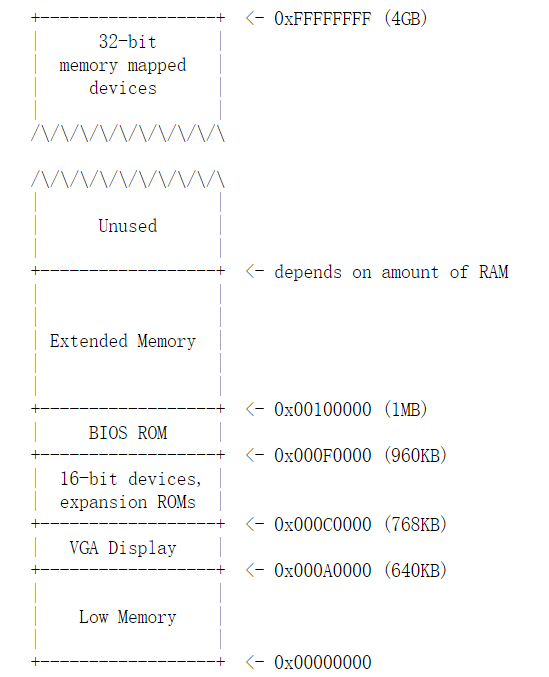

* QEMU的debug模式：先一个终端运行```make qemu-nox-gdb```，后另外一个终端运行```make gdb```，使用```si```来进行调试步进
* 首先QEMU中执行的是BIOS代码，一开机通过硬件电路，BIOS代码直接加载到内存中，CS:IP会指向[0xf000:0xfff0]，CS左移一位就是0xffff0，指向的代码是一个jmp指令
* BIOS运行过程中，它设定了中断描述符表，对VGA显示器等设备进行了初始化。在初始化完PCI总线和所有BIOS负责的重要设备后，它就开始搜索软盘、硬盘、或是CD-ROM等可启动的设备。最终，当它找到可引导磁盘时，BIOS从磁盘读取引导加载程序并将控制权转移给它

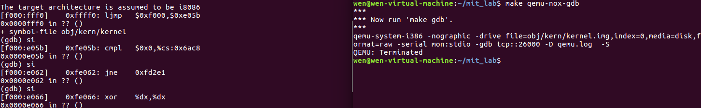

### Part2. The Boot Loader

* 当BIOS找到一个可引导的软盘或硬盘时，它将512字节的引导扇区加载到物理地址0x7c00到0x7dff的内存中，然后使用jmp指令将CS： IP设置为0000：7c00，并将控制传递给引导加载程序。
* 由于扇区最大为512B，boot loader必须满足于512字节。
* boot loader由一个汇编语言源文件 boot/boot.S 和一个C源文件 boot/main.c 组成
* boot loader必须执行两个主要功能：
  *  将处理器从real模式切换到32位保护模式，因为只有在保护模式下，软件才能访问处理器的物理地址空间中超过1MB的所有内存。在受保护的模式下，[CS:IP]不是像real模式一样直接指定了执行的物理地址，而是提供了一个段选择器和一个偏移量，通过段选择器和偏移量的组合来定位线性地址。
  *  通过x86的特殊I/O指令直接访问IDE磁盘设备寄存器，从而从硬盘中读取内核（也就是读取操作系统）
* obj/boot/boot.asm 是 boot.S 的反汇编，很有用，可以看到每个指令的确切物理位置 

#### boot.S

主要任务——从real模式切换为保护模式

```asm
#include <inc/mmu.h>

# Start the CPU: switch to 32-bit protected mode, jump into C.
# The BIOS loads this code from the first sector of the hard disk into
# memory at physical address 0x7c00 and starts executing in real mode
# with %cs=0 %ip=7c00.

.set PROT_MODE_CSEG, 0x8         # kernel code segment selector
.set PROT_MODE_DSEG, 0x10        # kernel data segment selector
.set CR0_PE_ON,      0x1         # protected mode enable flag 这个变量是开启A20地址线的标志，为1是开启保护模式

.globl start

start:
  .code16                     # Assemble for 16-bit mode
  cli                         # Disable interrupts 关中断
  cld                         # String operations increment 将direct flag标志位清零，这意味着自动增加源索引和目标索引的指令(如MOVS)将同时增加它们

  # Set up the important data segment registers (DS, ES, SS). 相当于全部置0
  xorw    %ax,%ax             # Segment number zero
  movw    %ax,%ds             # -> Data Segment
  movw    %ax,%es             # -> Extra Segment
  movw    %ax,%ss             # -> Stack Segment

  # Enable A20:
  #   For backwards compatibility with the earliest PCs, physical
  #   address line 20 is tied low, so that addresses higher than
  #   1MB wrap around to zero by default.  This code undoes this.
  #   由于历史原因A20地址位由键盘控制器芯片8042管理。所以要给8042发命令激活A20
  #   8042有两个IO端口：0x60和0x64， 激活流程位： 发送0xd1命令到0x64端口 --> 发送0xdf到0x60

seta20.1:
  inb     $0x64,%al               # Wait for not busy 从0x64读取8位并传到a寄存器的低8位
  testb   $0x2,%al                # 进行与运算，但不会改变a寄存器的值，只会改变标志位，发送命令之前，要等待键盘输入缓冲区为空，这通过8042的状态寄存器的第2bit来观察
  jnz     seta20.1                # ZF标志位不为0时跳转，如果状态寄存器的第2位为1，就跳到seta20.1符号处执行，知道第2位为0，代表缓冲区为空
  movb    $0xd1,%al               # 0xd1 -> port 0x64
  outb    %al,$0x64               # 发送0xd1到0x64端口

seta20.2:
  inb     $0x64,%al               # Wait for not busy
  testb   $0x2,%al
  jnz     seta20.2
  movb    $0xdf,%al               # 0xdf -> port 0x60
  outb    %al,$0x60               # 与上述相似，发送0xdf到0x60端口

  # Switch from real to protected mode, using a bootstrap GDT
  # and segment translation that makes virtual addresses 
  # identical to their physical addresses, so that the 
  # effective memory map does not change during the switch.
  # A20激活完成，转入保护模式

  lgdt    gdtdesc                 # lgdt命令加载全局描述符，指定一个临时的GDT，来翻译逻辑地址。这里使用的GDT通过gdtdesc段定义。它翻译得到的物理地址和虚拟地址相同，所以转换过程中内存映射不会改变

  # 打开保护模式标志位，相当于按下了保护模式的开关。cr0寄存器的第0位就是这个开关，通过CR0_PE_ON或cr0寄存器，将第0位置1
  movl    %cr0, %eax
  orl     $CR0_PE_ON, %eax        # 或运算
  movl    %eax, %cr0

  # Jump to next instruction, but in 32-bit code segment.
  # Switches processor into 32-bit mode.
  ljmp    $PROT_MODE_CSEG, $protcseg  # PROT_MODE_CSEG是0x8，选择子选择了GDT中的第1个段描述符，即保护模式下跳转到代码段（详细见下图）

  .code32                     # Assemble for 32-bit mode
protcseg:
  # Set up the protected-mode data segment registers 重新初始化各个段寄存器
  movw    $PROT_MODE_DSEG, %ax    # Our data segment selector
  movw    %ax, %ds                # -> DS: Data Segment
  movw    %ax, %es                # -> ES: Extra Segment
  movw    %ax, %fs                # -> FS
  movw    %ax, %gs                # -> GS
  movw    %ax, %ss                # -> SS: Stack Segment

  # Set up the stack pointer and call into C.
  movl    $start, %esp            # 栈顶设定在start处，也就是地址0x7c00处
  call bootmain                   # call函数将返回地址入栈，将控制权交给bootmain

  # If bootmain returns (it shouldn't), loop.
spin:
  jmp spin

# Bootstrap GDT
.p2align 2                                # force 4 byte alignment
# 定义全局描述符表
gdt:
  SEG_NULL				# null seg
  SEG(STA_X|STA_R, 0x0, 0xffffffff)	# code seg 代码段
  SEG(STA_W, 0x0, 0xffffffff)	        # data seg 数据段

# 构造gdt结构
gdtdesc:
  .word   0x17                            # sizeof(gdt) - 1
  .long   gdt                             # address gdt
```

保护模式下的寻址方式

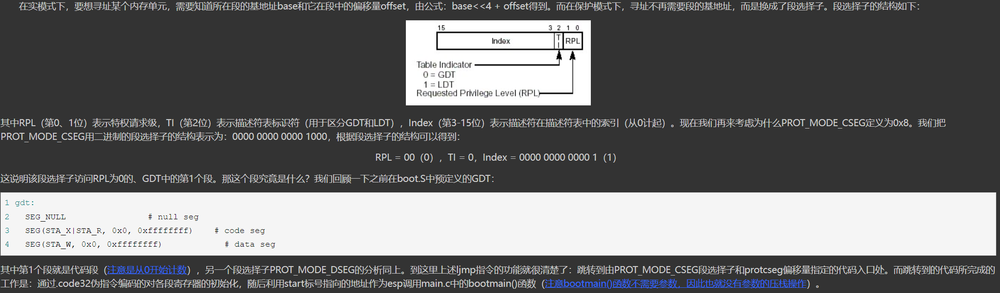

#### main.c

主要功能——将内核从硬盘读取进内存，然后进入内核入口。

可以把ELF可执行文件看作是一个包含加载信息的头，然后是几个程序部分，每个部分都是一个连续的代码或数据块，包含了在指定的地址加载到内存的信息

内核，也就是操作系统，存储在地址从0x10000开始的内存中

##### exercise 6
CPU从什么时候开始执行32-bit的代码？
* ```ljmp    $PROT_MODE_CSEG, $protcseg```及其之后

是什么导致了从16-bit到32-bit的切换？
* A20的激活，以及```movl    %eax, %cr0```

内核引导器最后执行和内核最先执行的指令是什么？干了什么事情？
* 内核引导器最后一个指令是```((void (*)(void)) (ELFHDR->e_entry))();```，由反汇编代码可看出程序跳转到地址*0x10018（注意是跳转到0x10018里面所存储的地址，而不是0x10018）
* 地址0x10018存储的信息是0x10000c，这个就是内核的入口，也就是内存中0x10000c存放着内核的第一个指令
* 查看反汇编代码obj/kern/kernel.asm，可以看到，内核第一个指令的地址是0x**f0**10000c，而C代码中函数跳转是到0x10000c
* 这个区别是由于虚拟内存机制中，虚拟地址和物理地址的不同导致的。虚拟地址为ELF文件在产生时，连接器给函数绑定的地址。处理器会进行地址映射，将虚拟地址映射到真实物理地址
* 内核最先执行的指令是```readseg((uint32_t) ELFHDR, SECTSIZE*8, 0);```，读取进来的是一个镜像，也就是ELF文件的部分内容。读取进来的信息包含了文件头，真正的读取还要根据文件头中包含的信息执行，之后main里面做的就是将内核一块一块一次读进内存中，即
```c++
for (; ph < eph; ph++)
	readseg(ph->p_pa, ph->p_memsz, ph->p_offset);
```

内核的第一个指令的地址是什么？
* 虚拟地址为0xf010000c，真实物理地址是0x10000c

内核引导器如何知道应该将多大的磁盘空间拷贝进内存？这个信息存放在哪里？
* 加载内核的过程就是一种加载elf文件的过程
* 解析elf文件可以得到内核每一块的size大小，也就知道要拷贝的内核有多大

### Part3. The Kernel

#### 虚拟内存机制

加载内核时，将内核加载到内存中0x100000位置上，这是“物理内存地址” （Physical Address），而之前解析elf文件时显示的地址在0xf0100000，这是“虚拟地址” （Virtual Address）

* 内核经常被放在较大的地址上，留出较小的地址给其他应用。不是所有的机器都有内核编译时候指定的0xf0100000这么多的内存空间，故要建立“虚拟地址”和“真实地址”之间的映射，从而让内核在物理内存中的真实位置按需改变，而在虚拟内存中的位置保持不变
* 只要映射得当，就可以正常运行，程序员不需要关心运行的真实物理内存地址，从而简化了开发。不单单是内核，其他程序也可以使用这种机制

kern/entry.S中修改了cr0和cr3寄存器
* PG位：CR0的位31是分页（Paging）标志。当设置该位时即开启了分页机制；当复位时则禁止分页机制，此时所有线性地址等同于物理地址。在开启这个标志之前必须已经或者同时开启PE标志，也就是先切换到保护模式（PE已在boot.S置位）
* CR3是页目录基址寄存器，保存页目录表的物理地址
```asm
# Load the physical address of entry_pgdir into cr3.  entry_pgdir is defined in entrypgdir.c.
  movl	$(RELOC(entry_pgdir)), %eax
  movl	%eax, %cr3

# Turn on paging.
	movl	%cr0, %eax
	orl	$(CR0_PE|CR0_PG|CR0_WP), %eax
	movl	%eax, %cr0
```

使用kern/entrypgdir.c中的静态初始化的页面目录和页表来完成虚拟内存映射，建立映射规则，将物理内存0x0-0xfffffff和虚拟地址0xf0000000-0xffffffff建立映射
```asm
pde_t entry_pgdir[NPDENTRIES] = {
	// Map VA's [0, 4MB) to PA's [0, 4MB)
	[0]
		= ((uintptr_t)entry_pgtable - KERNBASE) + PTE_P,

	// Map VA's [KERNBASE, KERNBASE+4MB) to PA's [0, 4MB)
	[KERNBASE>>PDXSHIFT]
		= ((uintptr_t)entry_pgtable - KERNBASE) + PTE_P + PTE_W
};
```
##### exercise 7

分别在运行 ```movl	%eax, %cr0``` 指令前后，观察虚拟内存中0x100000和0xf0100000地址里的数据

* 可发现开启分页前后0x100000里的数据不变，也就是都存有内核的第一条指令
* 但开启分页前0xf0100000里不存有数据，开启分页后由于经过映射，把0x100000中的数据映射到0xf0100000中，所以现在两个地址的数据相同

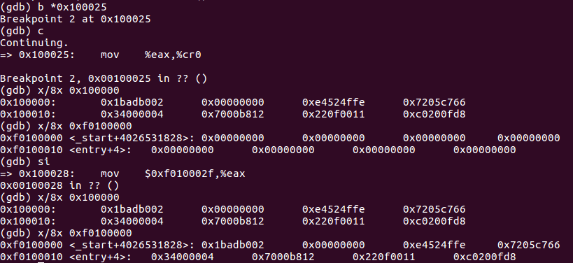

#### 格式化输出到控制台

主要看三个文件：kern/printf.c, kern/console.c 和 lib/printfmt.c

终端调用的打印函数是kern/printf.c中的cprintf函数，而其中实际调用的是lib/printfmt.c中的vprintfmt函数，而其中的打印字符函数是kern/console.c中的cputchar函数

##### exercise 8

省略了一小段代码 - 使用“％o”形式的模式打印八进制数所需的代码。 查找并填写此代码片段。

在ib/printfmt.c的vprintfmt函数中加入

```c
// （无符号）八进制
case 'o':
  putch('0', putdat)
  num = getuint(&ap, lflag);
  base = 8;
  goto number;
```

可在kern/init.c的i386_init函数中添加自己的测试代码，如下（加label是为了能够在asm文件中定位到自己的新加代码，而且要记住该label要顶格写）

```c
// Lab 1 exercise 8 test
{
  int x = 1, y = 3, z = 4;

Lab1_exercise8_3:
  cprintf("x %d, y %x, z %d\n", x, y, z);
}
```

另外，C函数调用实参的入栈顺序是从右到左的，才使得调用参数个数可变的函数成为可能(且不用显式地指出参数的个数)

#### 堆栈

##### 初始化

确定内核在什么时候初始化了堆栈
* entry.S 中的 ```movl	$(bootstacktop),%esp```。将一个宏变量bootstacktop的值赋值给了寄存器esp。而bootstacktop出现在bootstack下，bootstack出现在.data段下，这是数据段。可以肯定，这就是栈了

堆栈所在内存的确切位置。
* 查看反汇编文件，如下，可知栈顶位置为0xf0117000
* **栈将向地址值更小的方向生长**，也就是栈顶比栈底的地址要小，将值压入堆栈涉及到堆栈指针-1，然后将值写入堆栈指针指向的位置。 从堆栈中弹出一个值包括读取堆栈指针指向的值，然后堆栈指针+1

```asm
movl	$(bootstacktop),%esp
f0100034:	bc 00 70 11 f0       	mov    $0xf0117000,%esp
```

内核如何为其堆栈保留空间
* 通过```.space```指令，在bootstack位置处初始化了KSTKSIZE这么多的空间。KSTKSIZE在inc/memlayout.h里面定义，是8*PGSIZE，而PGSIZE在inc/mmu.h中定义，值为4096。这样一顿找，我们知道了，栈在内核入口的汇编代码中初始化，是通过一个汇编指令.space，大小是8 * 4096

##### 调用函数

在执行新的函数callee代码之前，先保存旧函数caller的栈的位置。这样一来，callee才可以返回到正确的指令上。通过ebp基址指针寄存器的值，Debugger可以迅速找到调用这个函数的函数，一路找到最开始执行这个函数的函数，这种操作称为backtrace。

看到反汇编代码obj/kern/kernel.asm中，所有C函数的第一个指令都是push %ebp，保存了旧的栈地址。第二个指令都是mov %esp, %ebp，将当前栈地址，也就是函数的栈的开头，保存到ebp。

##### 函数返回

函数返回时，寄存器eip，也就是Instruction Pointer，跳转到调用本函数的call指令的下一个指令，且esp增加。栈是向下增长的，所以这其实是在“弹出”。调用函数时，函数接受的参数都被压栈，故返回时相应弹出。

> EIP存储着下一条指令的地址，每执行一条指令，该寄存器变化一次。
> 
> EBP存储着当前函数栈底的地址，栈低通常作为基址，我们可以通过栈底地址和偏移相加减来获取变量地址（很重要）。
> 
> ESP始终指向栈顶，只要ESP指向变了，那么当前栈顶就变了。

##### exercise 10
在obj/kern/kernel.asm找到test_backtrace函数，并设置断点。进行调试。

每次回溯相当于x-1，最后x小于等于0时调用函数mon_backtrace，该函数需我们实现

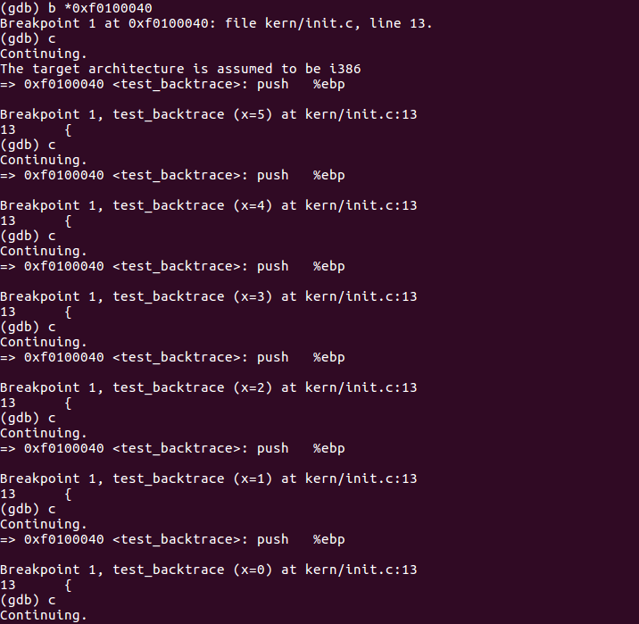

##### exercise 11
编写mon_backtrace函数，使其输出如下

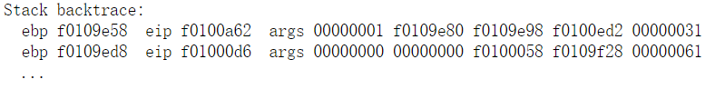

* ebp是堆栈的基指针，也是调用函数的返回地址。调用函数返回之后，程序需要知道从哪里继续执行，因此，在调用函数之前，返回地址会被压入堆栈中，指示程序在函数执行完后应该返回的地址。
* eip是调用函数里的第一条指令所对应的地址
* args是函数调用时的参数
* 可知，堆栈由栈顶到栈底依次是args、eip和ebp

```c
int
mon_backtrace(int argc, char **argv, struct Trapframe *tf)
{
  // Your code here.
  uint32_t *ebp;
    ebp = (uint32_t *)read_ebp(); // 读ebp
    cprintf("Stack backtrace:\n");
    while(ebp!=0){
        cprintf("  ebp %08x",ebp);
        cprintf("  eip %08x  args",*(ebp+1));
        cprintf("  args");
        cprintf(" %08x", *(ebp+2));
        cprintf(" %08x", *(ebp+3));
        cprintf(" %08x", *(ebp+4));
        cprintf(" %08x", *(ebp+5));
        cprintf(" %08x\n", *(ebp+6));
        ebp  = (uint32_t*) *ebp; // 调用函数返回，返回前一个调用函数所对应的堆栈的栈底
    }
  return 0;
}
```

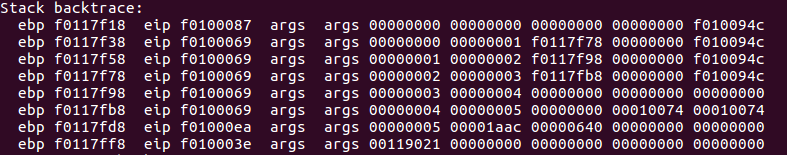

## HW 1: Boot xv6

注意 homework 的工程是 xv6-public，而不是 JOS

##### exercise：查看栈中的内容

* 在运行完```make qemu-gdb```后，运行```make gdb```
* 打断点在内存 0x1000c 处，为内核的入口指令，即```mov  %cr4,%eax```（与JOS不同）
* 查看reg内存储信息
* 详细查看esp及后面23个字的数据，也就是看了堆栈存储的从栈顶开始的24个字的数据

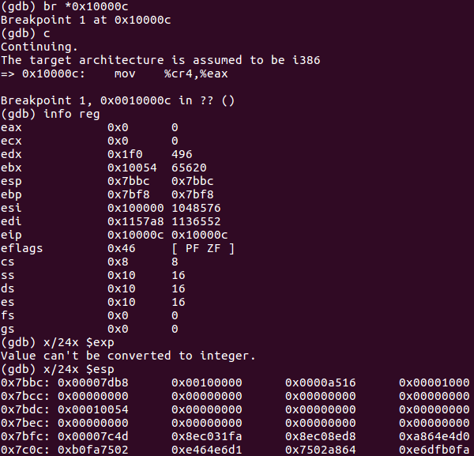

* 为了解释栈中的内容都为什么，主要需要查看三个文件 bootasm.S, bootmain.c, and bootblock.asm
* 第一行第一个地址 0x00007db8 是bootmain函数调用 entry函数的下一行代码的地址
* 第五行第一个0x00007c4d是 bootmain 的返回地址
* 其他夹在上述两个地址中间的应该就是bootmain函数中的push进栈的内容

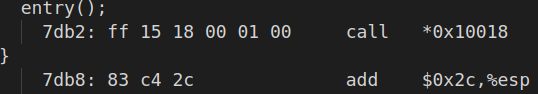

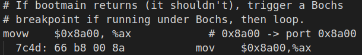

## HW 2: Shell

参考：[https://blog.csdn.net/a747979985/article/details/95094094](https://blog.csdn.net/a747979985/article/details/95094094)

下载 sh.c 后 gcc 编译生成可执行文件 hw2_test.exe，下载 t.sh，使用命令```./hw2_test < t.sh```报错，是因为redir，exec，pipe函数没有实现

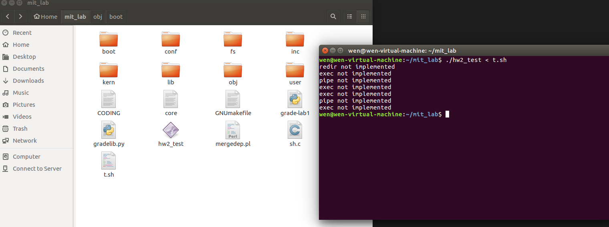

举个shell命令的例子：

```c++
ls > y // 把当前目录ls的文件列表输出到y中
cat < y | sort | uniq | wc > y1 // “|” 是 管道命令：读取y的内容，然后将y的内容排序，去掉重复，统计字数行数，并把结果保存到y1
cat y1 // 显示文件 y1 的内容
vrm y1 // 删除文件 y1。
ls | sort | uniq | wc // 列出当前目录的文件列表，经过排序、去重、统计行数后输出结果
rm y // 删除文件 y
```

下面将补全sh.c中的代码，主要是填写runcmd函数中的case

##### 执行单个命令（case ' '）

如执行ls命令，但也要考虑ls命令是在二级目录或者三级目录中的情况

```c++
case ' ':
  ecmd = (struct execcmd*)cmd;
  if(ecmd->argv[0] == 0)
    _exit(0);
  // fprintf(stderr, "exec not implemented\n");
  // Your code here (逻辑：若当前路径找不到该命令，则明确为在bin中找，若仍找不到，则继续明确为在/usr/bin中找)
  // execv会停止执行当前的进程，并且以argv[0]应用进程替换被停止执行的进程，进程ID没有改变，argv为该进程参数，一般正常执行时该函数不会返回
  if(execv(ecmd->argv[0],ecmd->argv)==-1){ 
    char mypath[20]="/bin/";
    strcat(mypath,ecmd->argv[0]);
    if(execv(mypath,ecmd->argv)==-1){
	    strcpy(mypath,"/usr/bin/");
	    strcat(mypath, ecmd->argv[0]);
	    if(execv(mypath,ecmd->argv)==-1){
		    fprintf(stderr, "Command %s can't find\n", ecmd->argv[0]);
		    _exit(0);
	    }
    }
  }
  break;
```

##### I/O重定向（case '>' 和 csar '<'）

I/O 重定向是指将进程的输入和输出重定向到其他地方（如一些文件），而不是默认的标准输入（stdin）和标准输出（stdout）

```c++
case '>':
case '<':
  rcmd = (struct redircmd*)cmd;
  // fprintf(stderr, "redir not implemented\n");
  // Your code here ...(实现I/O的重定向，需先释放对应的文件描述符(close)，再通过打开需要重定向目标文件(open))
  close(rcmd->fd);
	if(open(rcmd->file, rcmd->flags, S_IRUSR | S_IWUSR | S_IRGRP | S_IROTH)<0){
      printf(stderr, "file %s can't find\n", rcmd->file);
      _exit(0);
	}
  runcmd(rcmd->cmd);
  break;
```

##### 实现进程间的管道通讯（csar '|'）

管道和标准输入输出流的文件描述符的操作流程如下图

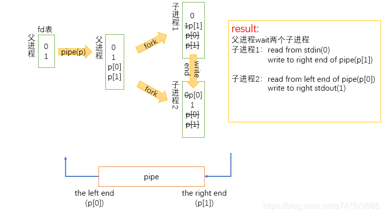

```c++
case '|':
  pcmd = (struct pipecmd*)cmd;
  // fprintf(stderr, "pipe not implemented\n");
  // Your code here ...
  // 建立一个缓冲区，并把缓冲区通过 fd 形式给程序调用。它将 p[0] 修改为缓冲区的读取端， p[1] 修改为缓冲区的写入端，p[0] 和 p[1] 都是文件描述符
  if(pipe(p) < 0){ 
    fprintf(stderr,"Fail to create a pipe\n");
    _exit(0);
  }
  /* 子进程执行*/
  if(fork1() == 0){// 这里判断的意思是，当前进程是子进程是执行括号下面的指令，否则不执行（因为子进程才会返回0）
  //child one:read from stdin(0), write to the right end of pipe(p[1])
    close(1); // 这里的1是stdin，关闭stdin，使用管道的写入端
    // dup函数产生并返回与传入参数fd指向同一文件的fd，这意味着两个fd可以独立地操作同一个文件。产生的fd总是空闲的最小fd
    dup(p[1]); // 这里是给管道写入端分配一个新的文件描述符给这个新的子进程
    close(p[0]); // 关闭旧的管道读取端
    close(p[1]); // 关闭旧的管道写入端
    runcmd(pcmd->left); // 执行‘|’符号左边的命令
  }
  wait(&r);
  /* 子进程执行 */
  if(fork1() == 0){
  //child two:read from the left end of pipe(p[0]), write to stdout(1)
    close(0); // 这里的0是stdout
    dup(p[0]); // 这里是给管道读取端分配一个新的文件描述符给这个新的子进程
    close(p[0]); // 关闭旧的管道读取端
    close(p[1]); // 关闭旧的管道写入端
    runcmd(pcmd->right); // 执行‘|’符号右边的命令
  }
    /* 父进程，子进程都执行 */
  close(p[0]);
  close(p[1]);
  wait(&r);
  break;
```

最终效果 ```gcc -o mit_shell sh.c```

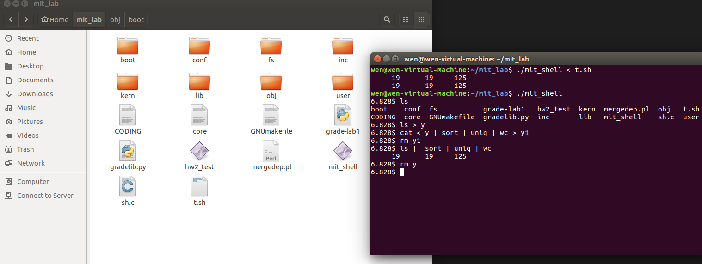

#### 额外重点1：fork函数

[看看这个，比较好理解](https://blog.csdn.net/cckluv/article/details/109169941)

fork()函数用于创建一个进程，所创建的进程**复制父进程的代码段/数据段/BSS段/堆/栈等所有用户空间信息**，在内核中操作系统重新为其申请了一个PCB，并**使用父进程的PCB进行初始化**

* 也就是新开的子进程将会和父进程并发进行，子进程开启后接下来执行的指令，与父进程接下来要执行的指令相同，且父子进程的现场一模一样

* fork调用的一个奇妙之处就是它仅仅被调用一次，却能够返回两次，一次函数返回是在父进程中，另一次是在新开的子进程中，它可能有三种不同的返回值：
  * 在父进程中，fork返回新创建子进程的进程ID
  * 在子进程中，fork返回0
  * 如果出现错误，fork返回一个负值

* 经常通过代码```if(fork() == 0)```来判断当前进程是父进程还是子进程，若是子进程才会执行该if语句里面的命令，从此开始父子进程走向不同

#### 额外重点2：IPC进程间通信方式

主要有 1.管道，2.信号量，3.消息队列，4.共享内存四种通信方式

[https://blog.csdn.net/skyroben/article/details/71513385](https://blog.csdn.net/skyroben/article/details/71513385)

* 管道通常用于具有父子关系的进程之间或者在同一台主机上的相关进程之间。它是一种单向的，同步的通信机制，可以在父进程和子进程之间传输数据
* 信号量是一种用于进程间同步和互斥的机制，可以用于控制对共享资源的访问。它可以实现进程间的互斥和同步，从而避免资源竞争和死锁
* 消息队列允许一个进程向另一个进程发送数据块。消息队列提供了一种异步的通信机制，发送方和接收方可以独立地进行读写操作，不需要同时存在
* 共享内存是一种高效的进程间通信方式，它允许多个进程访问同一块物理内存，从而可以直接读写共享数据，而无需数据的复制。共享内存通常用于需要高性能和低延迟的场景

## Lab 2: Memory Management

首先需切换分支

```c++
git checkout lab2
git merge lab1 // 需解冲突
```

我们将编写操作系统的内存管理代码，内存管理有两个组成部分
* 第一个部分是内核的物理内存分配器，以致于内核可以分配和释放内存。 分配器将以4096字节为操作单位，称为一个页面。 我们的任务是维护一个数据结构，去记录哪些物理页面是空闲的，哪些是已分配的，以及共享每个已分配页面的进程数。 我们还要编写例程来分配和释放内存页面。
* 内存管理的第二个组件是虚拟内存，它将内核和用户软件使用的虚拟地址映射到物理内存中的地址。 当指令使用内存时，x86硬件的内存管理单元（MMU）执行映射，查询一组页表。 我们根据任务提供的规范修改JOS以设置MMU的页面表。
* lab2包含的新源文件：inc/memlayout.h, kern/pmap.c, kern/pmap.h, kern/kclock.h, kern/kclock.c
  * memlayout.h描述了必须通过修改pmap.c进行实现的虚拟地址空间的布局
  * memlayout.h和pmap.h定义您将使用的PageInfo结构来跟踪哪些页面是空闲的
  * kclock.c和kclock.h操纵PC的电池支持的时钟和CMOS RAM硬件，其中BIOS记录了PC所含的物理内存量，以及其他事项。pmap.c中的代码需要读取此设备硬件以找出有多少物理内存，但是代码的那一部分不用您完成，您不需要知道CMOS硬件如何工作的详细信息。

### Part 1. 物理内存页管理

操作系统必须跟踪物理RAM的哪些部分是空闲的以及哪些是当前正在使用的。JOS以页为粒度管理PC的物理内存，以便它可以使用MMU映射和保护每个分配的内存

现在，您将编写物理页面分配器(physical page allocator)。它通过结构体PageInfo对象的链接列表来跟踪哪些页面是空闲的，每个对象都对应于一个物理页面

实现kern/pmap.c 中的以下函数
* boot_alloc()
* page_init()
* page_alloc()
* page_free()

Page分配器是以page为单位操作内存的，之后几乎所有管理内存的机制都是以page为单位。page就是将所有的内存地址分成长度相同的一个个区块，每个的长度都是4096字节。所有可以分配的内存都注册到一个链表中，通过分配器，可以方便地拿到一个未分配的page

内存管理组件维护一个链表，称为free list，这个链表将所有未分配的page连起来。需要分配内存时，将链表头部对应的page返回，并将链表头部更新为链表中的下一个元素

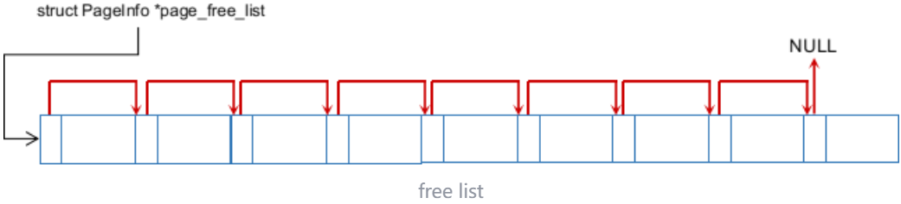

定义页描述符结构体（memlayout.h），数组中第i个成员代表内存中第i个page。故物理地址和数组索引很方便相换算。初始化时，形成一个链表，所有可分配的page都以struct PageInfo的形式存在于链表上。要通过分配器拿到一个page，也就是读取链表开头的节点，这个节点就对应一个page

```c++
struct PageInfo {
  // 空闲列表中的下一页
  struct PageInfo *pp_link;
  // pp_ref是指使用page_alloc分配的页面，指向该页面的指针（通常在页表项中）的数量
  // 通常会同时在多个虚拟地址（或在多个环境的地址空间中）映射相同的物理页面，pp_ref就是统计该物理页面被引用的次数
  // 使用pmap.c的boot_alloc在启动时分配的页面没有有效的引用计数域。
  // 当物理页面的计数为零时，可以释放该页面，因为它不再被使用
  uint16_t pp_ref;
};
```

**page_alloc**：内核的其他代码通过该函数从free list取出一个page，返回当前page_free_list指针，并令page_free_list指针指向原链表中的下一个元素、

```c++
struct PageInfo *
page_alloc(int alloc_flags)
{
	// 若是没有空闲的内存了返回NULL
	if(page_free_list == NULL){
		return NULL;
	}
	struct PageInfo *pp = page_free_list; // 获得一个空闲页
	page_free_list = page_free_list->pp_link; // 空闲页描述符指向下一个空闲的页
	pp->pp_link = NULL; // 为了使page_free正常运行和准确判断，该页已经不是空闲了，所以它也不要指向下一个空闲页
	if(alloc_flags & ALLOC_ZERO){
		char *va = page2kva(pp); // 函数page2kva，接受一个PageInfo指针，返回得到相应page的虚拟地址
		memset(va, 0, PGSIZE); // 初始化页
	}
	return pp;
}
```

**page_free**：释放指定页

```c++
void
page_free(struct PageInfo *pp)
{
	if (pp->pp_ref != 0 || pp->pp_link != NULL) { // 若其他地方仍在使用该页，或是该页面已经空闲了，则报错
	    panic("Page double free or freeing a referenced page...\n");
	}
	pp->pp_link = page_free_list; // 将该页作为page_free_list
	page_free_list = pp; // 之前的page_free_list跟在该页后面
}
```

**boot_alloc**：page分配组件完成初始化之前，使用boot_alloc函数分配内存，pages数组就是这个函数分配的。
* 函数接受一个参数，代表要多少字节内存，函数将这个字节数调整为离这个字节数最近的4096的整数倍，以求每次分配都是以page为单位的。
* end指针是连接器产生的，可以看连接配置文件kern/kernel.ld的53行，GCC编译器中链接器脚本文件(.ld文件)用于设置堆空间大小、栈空间大小，然后根据应用的请求设置栈的位置 
* boot分配器只能在page分配器初始化完成之前使用，之后一律使用page分配器

```c++
static void *
boot_alloc(uint32_t n)
{
	static char *nextfree;	//  指向空闲内存的下一字节的虚拟地址 virtual address of next byte of free memory
	char *result;
	// 如果nextfree为null时(第一次调用该函数)，则初始化 nextfree
	// 'end'是一个由链接器自动生成的指向内核bss段的末端的神奇符号，它是链接器没有分配给任何内核代码或全局变量时的起始虚拟地址
	if (!nextfree) {
		extern char end[];
		nextfree = ROUNDUP((char *) end, PGSIZE);
	}
	// 分配一个足以容纳'n'字节的内存块，然后赋给nextfree, 确保nextfree与PGSIZE的倍数保持一致
	// LAB 2: Your code here.
	// 如果n==0，返回下一个空闲页的地址，不分配任何东西
	if (n == 0) {
	    return nextfree;
	}
	// n > 0，可以分配内存，此时result就是返回的虚拟地址，然后更新nextfree指向下一个可以分配的内存的虚拟地址
	result = nextfree;
	nextfree = ROUNDUP(n, PGSIZE) + nextfree; 
	// 申请的内存超了
	if (nextfree > (char *)0xf0400000) {
	    panic("boot_alloc: out of memory, nothing changed, returning NULL...\n");
	    nextfree = result;    // reset static data
	    return NULL;
	}
	return result;
}
```

**page_init**：初始化空闲页链表

* 在初始化内存组件的函数mem_init中，首先调用了函数i386_detect_memory获得了内存硬件信息，得到的内存信息是两个整数npages, npages_basemem，分别代表**现有内存**的page个数，以及在**拓展内存之前**的page个数
* 在文件kern/memlayout.h中，有一个虚拟内存的布局示意图，主要描绘用户区内存分配，而不是指出物理内存分布，故我们暂时不细看它。地址0xf0000000以上的区域，也就是我们现在已经映射的区域，是我们关心的区域。宏KERNBASE就是0xf0000000，同时这个地址也是内核栈的开端。以下为了讲述方便，所有地址都是**物理内存**

```c++
/*
 *                     .                              .
 *                     .       Managable Space        .
 *                     .                              .
pages ends 0x158000 -->+------------------------------+
 *                     |                              |
 *                     .                              .
 *                     .   pages management array     .
 *                     .                              .
 *                     |                              |
 *  pages 0x118000 ->  +------------------------------+
 *                     |        Kernel is here        |
 *    EXT 0x100000 ->  +------------------------------+
 *                     |                              |
 *                     |          IO Hole             |
 *                     |                              |
 * BASEMEM 0xa0000 ->  +------------------------------+
 *                     |    Basic Managable Space     |
 *    KERNBASE ----->  +------------------------------+
 */
```

> 三个常用段
> 
> .text 代码段：程序中的可执行部分，是由函数堆叠而成的
> 
> .data 数据段(数据区、静态数据区、静态区)：程序中的数据，C语言中的全局变量（全局变量才算程序的数据，局部变量是函数的数据）
>
> .bss bss段(ZI段（zero initial）：被初始化为0，bss段本质上也是属于数据段。也就是说bss段就是被初始化为0的数据段
>
> 本质上来说.data和bss都是用来存放C程序中的全局变量的。区别在于把显式初始化为非零的全局变量存放在.data段中，把显式初始化为0或没有显式初始化的全局变量存放在bss段中。（这也就是为什么C语言中未显式初始化的全局变量的值为默认为0）


1. 从KERNBASE开始想起。回顾Lab 1我们知道，内存0xf0000-0x100000是BIOS映射区，在这之前又是ROM映射区，这段空间不能使用，不能被分配器分配出去。在文件inc/memlayout.h中，宏IOPHYSMEM（0xa0000）定义了这段IO段内存的开头
2. 在IOPHYSMEM之前还有一些内存没有分配，这部分内存是可以使用的。函数i386_detect_memory得到的npages_basemem就是这一段的长度，初始化page分配器时应该包含这一段。可以验证一下，npages_basemem的值为160，总的page大小为160 * 4096 = 655360 = 0xa0000，确实是IOPHYSMEM
3. 从0x100000开始以上的内存就是内核，可以回顾Lab 1中探索内核结构的结果，内核的.text区的虚拟地址为0xf0100000，物理地址正是0x100000。文件inc/memlayout.h中定义的宏EXTPHYSMEM就是0x100000，意思是BIOS以上的内存，称为拓展区，其上限由RAM硬件大小决定

初始化后的空闲页链表图如下

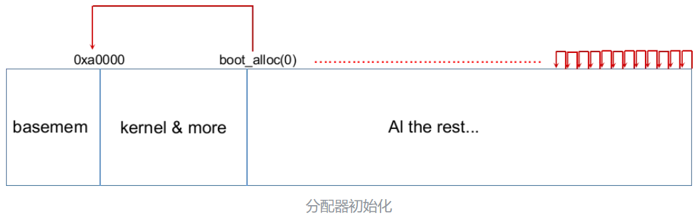

```c++
void
page_init(void)
{
	int num_alloc = ((uint32_t)boot_alloc(0) - KERNBASE) / PGSIZE; //前面有调用boot_alloc函数分配的内存
	int num_iohole = (EXTPHYSMEM - IOPHYSMEM) / PGSIZE;
	size_t i;
	for (i = 0; i < npages; i++) {
		// 1）物理页第0页为已使用
		// 	 这样我们就可以保留实模式下的 IDT 和 BIOS 结构。
		// 	 以防万一我们需要它们。 (目前我们不需要，但是...)
		if (i == 0){
			pages[i].pp_ref = 1;
		}
		// 2) 然后是IO专门分配空间[IOPHYSMEM, EXTPHYSMEM)，它肯定是无法被分配的。
		else if(i >= npages_basemem && i < npages_basemem + num_iohole + num_alloc){
        	pages[i].pp_ref = 1;
		}
		// 3) 剩下的基本内存，[PGSIZE, npages_basemem * PGSIZE)是空闲的
		// 4) 然后是扩展内存 [EXTPHYSMEM, ...)。
		//	有些在使用中，有些是空闲的。内核位于物理内存中的哪个地方, 哪些页已经被使用于页表和其他数据结构？
		// 分配给内核的内存之后的内存，也可以使用 extended pages after kernel
		else{
			pages[i].pp_ref = 0; // 使用该页的数量初始化时都设为0
			pages[i].pp_link = page_free_list; // 连接上一个空闲页
			page_free_list = &pages[i]; // 更新最新的空闲页为此页,制造链式结构
		}
	}
}
```

需用到的函数如下

```c++
// memlayout.h
#define	KERNBASE	0xF0000000 // 虚拟地址对于物理地址的偏移

// mmu.h
#define PGNUM(la)	(((uintptr_t) (la)) >> PTXSHIFT) // 计算la是第几页
#define PGSIZE		4096		// bytes mapped by a page 每一页为4096B
#define PGSHIFT		12		// log2(PGSIZE) 对4096求2的对数（2的12次方为4096）

// pmap.h
// 将内核虚拟地址kva转成对应的物理地址
#define PADDR(kva) _paddr(__FILE__, __LINE__, kva)
static inline physaddr_t
_paddr(const char *file, int line, void *kva)
{
	if ((uint32_t)kva < KERNBASE)
		_panic(file, line, "PADDR called with invalid kva %08lx", kva);
	return (physaddr_t)kva - KERNBASE;
}
// 将物理地址pa转化为内核虚拟地址
#define KADDR(pa) _kaddr(__FILE__, __LINE__, pa)
static inline void*
_kaddr(const char *file, int line, physaddr_t pa)
{
	if (PGNUM(pa) >= npages)
		_panic(file, line, "KADDR called with invalid pa %08lx", pa);
	return (void *)(pa + KERNBASE);
}
// 通过空闲页结构得到这一页起始位置的物理地址
static inline physaddr_t
page2pa(struct PageInfo *pp)
{
	return (pp - pages) << PGSHIFT;
}
// 通过物理地址pa获取这一页对应的页结构体struct PageInfo
static inline struct PageInfo*
pa2page(physaddr_t pa)
{
	if (PGNUM(pa) >= npages)
		panic("pa2page called with invalid pa");
	return &pages[PGNUM(pa)];
}
// 通过空闲页结构得到这一页起始位置的虚拟地址
static inline void*
page2kva(struct PageInfo *pp)
{
	return KADDR(page2pa(pp));
}
```

### Part 2. 内核内存映射

x86内存管理机制：弄清楚x86的内存管理机制，是本文的核心，也是这个Lab的核心。

x86建立了两次映射，程序给出地址，经过这两次翻译之后，才输出从到总线交给内存芯片。这两次映射分别为 **Segment Translation** 和 **Page Translation** 
* Segment Translation将虚拟地址转化为线性地址Linear Address
* Page Translation将线性地址转化为物理地址，也就是真正用来索引内存的物理地址
* 在本项目中，还没有做Segment Translation映射虚拟地址的处理，所以线性地址和虚拟地址相同

##### Segment Translation

Segment Translation的过程可以如下图表示，由一个事先指定的selector选择器，从一个描述符表descriptor table中读出一个描述符descriptor。由这个描述符读出一个基地址base address，虚拟地址作为一种偏置offset，加到基地址上，就得到了linear address

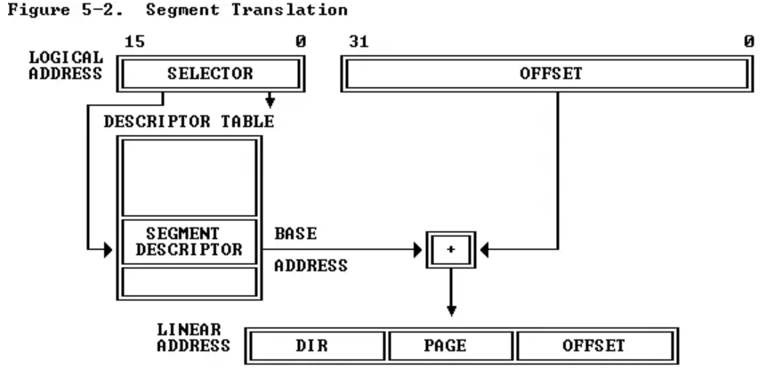

* 描述符表Descriptor Table：描述符表必须事先指定，虚拟地址中不包含关于描述符表的信息。有两种描述符表，分别为全局描述符表Global Descriptor Table (GDT)和本地描述符表Local Descriptor Table (LDT)，分别使用寄存器GDTR, LDTR获得
* 描述符Descriptor：通过selector索引描述符表得到的描述符，除了基地址之外，也包含了其他信息。这是两种不同的结构，其中的区别只有DPL和TYPE之间的那个bit，以及TYPE的位置。这里需要注意的是P域，也就是Segment Present bit，表示这个segment是否在内存中，之后的Page Translation也有类似机制

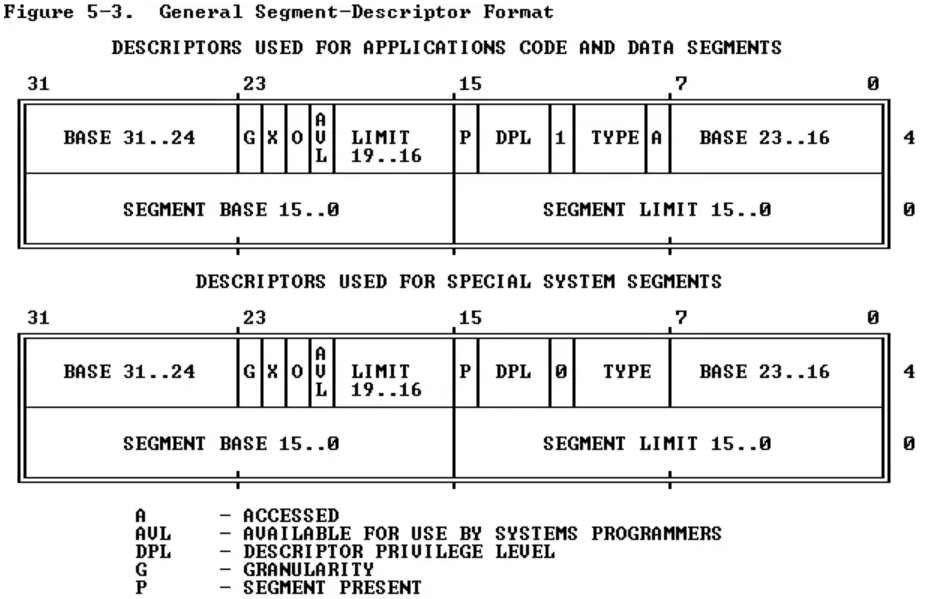

* 选择符Selector：选择符不但有描述符表的索引，还有选择描述符表GDT/LDT的bit，以及发出的请求所在的优先级，用于区分User Level Access和Kernel Level Access

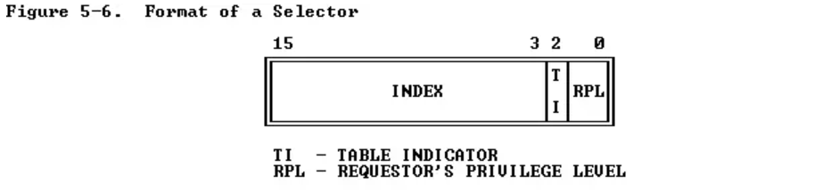

* 和segment有关的寄存器：虚拟地址只是一个segment的偏置，本身不包含和segment有关的信息。当前使用的描述符表、描述符选择符，都要另外存储在一些寄存器里面。当使用和跳转有关的指令call, jmp时，这些寄存器被隐式地访问了，从而帮助计算新的地址。segment寄存器有两个部分，可以直接操作和读取的是16bit的selector域，修改selector域之后，硬件自动将对应的描述符从描述符表中读取进不显示的descriptor域，这样就方便了后续操作

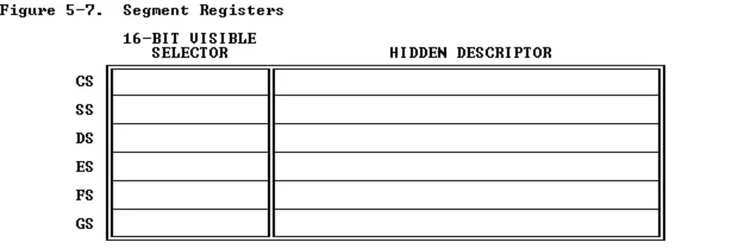

##### Page Translation

虚拟地址，也就是线性地址，被拆成了三部分，都是一种索引index，分别索引的是Page Directory, Page Table, Page Frame
* 利用DIR从page directory中读出DIR Entry，进而得到page table 的地址
* 再利用PAGE从读到的page table地址中读到PG TBL Entry，进而得到page frame的地址
* 最后利用OFFSET索引page frame之后，就得到相应物理地址上的内容
* 另外，只有当设置了CR0的PG位时，页面转换才有效

对于开发者来说，page directory, page table都是两个数组，拿到page directory的头部指针，和虚拟地址一起，就可以确定物理地址

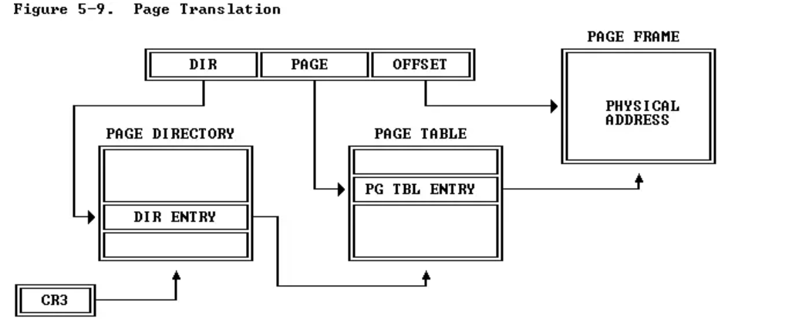

| 名字 | 作用  |
|------|----------------------------------------|
| PAGE DIRECTORY | 存放各个DIR ENTRY的表，其物理地址存在寄存器CR3中  |
| DIR ENTRY | 其高20位存放各PAGE TABLE的对应的物理地址的高20位                         |
| PAGE TABLE   | 存放PG TBL ENTRY                                  |
| PG TBL ENTRY  | 其高20位存放各页的对应的物理地址的高20位              |

线性地址，也就是虚拟地址，的格式如下


每个域包含bit的个数，也就是长度，决定了每个域对应的数组的长度。我们可以很方便地得到每个域对应的长度：

```
page_len = 2 ** 12 = 4096            // OFFSET
page_table_len = 2 ** 10 = 1024      // PAGE
page_dir_len = 2 ** 10 = 1024        // DIR
```

所以一个page directory指向1024个page directory entry，一个page directory entry指向了1024个page table，一个page table entry指向了1024个page frame，一个page frame中包含4096Bytes

page directory entry, page table entry具有相同格式，如下：

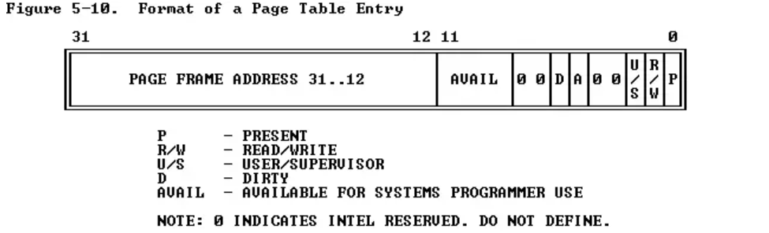

DIR, PAGE域长度相同，而entry的格式也相同，说明page directory和page table其实是相同结构的嵌套。可以把page directory理解为高一级的page table，整个内存管理形成两个层级。一个page table自身就是一个page，是有page directory管理的，而page table又管理了page frame

对于page directory来说，entry中12-31位上的PAGE FRAME ADDRESS就是一个page table的基地址。对于page table来说，这个地址是一个page frame的基地址。通过一个虚拟地址，获得3个索引，一次访问这3个结构，就可以得到物理地址了

这里还要注意一下，bit 0是Present Bit，表示当前entry中的信息是否可以用于映射。要是Present Bit设置为0，则这个entry不包含有效信息。索引各种page directory/table时，必须先检查这个bit

需要注意的一点就是虚拟地址和物理地址的类型，我们只能对虚拟地址解引用，对物理地址解引用会得到未定义的结果：

 C type |	Address type 
 -|-
 T*  |	Virtual
uintptr_t | 	Virtual
physaddr_t  |	Physical

实现kern/pmap.c 中的以下函数：
* pgdir_walk()
* boot_map_region()
* page_lookup()
* page_remove()
* page_insert()

**pgdir_walk**：接受一个page directory和一个虚拟地址，要求得到虚拟地址在这个page directory下对应的page table entry

```c++
// 用于pgdir_walk函数，根据PAGE DIR ENTRY创建page table
static struct PageInfo *create_pgtbl(pde_t *pde) {
  struct PageInfo *pageInfo;
  pageInfo = page_alloc(ALLOC_ZERO); // 取出一个空闲页，作为page table
  if (pageInfo == NULL) {
      // 取出失败
      return NULL;
  }
  // 该空闲页的引用数必须加1
  pageInfo->pp_ref += 1;
  // 获取该page table对应的物理地址，该物理地址经过下一步的处理后成为dir entry
  *pde = page2pa(pageInfo);
  // 设置dir entry为有效，且是用户级，且是写操作
  *pde |= PTE_U | PTE_P | PTE_W;
  return pageInfo;
}

pte_t *
pgdir_walk(pde_t *pgdir, const void *va, int create)
{
  uintptr_t pdx = PDX(va); // DIR
  uintptr_t ptx = PTX(va); // PAGE
  uintptr_t pgoff = PGOFF(va); // OFFSET

  pde_t *pde = &pgdir[pdx]; // 根据DIR字段和PAGE DIRECTORY获取DIR ENTRY

  if (!*pde & PTE_P) { // DIR ENTRY中的Present Bit为0,表示对应的page table无效
      if (create) {// 该page table不存在，需要创建
          // 创建page table，并返回该页结构体，pde现在是dir entry
          struct PageInfo *pageInfo = create_pgtbl(pde);
          if (pageInfo == NULL) {
              // 分配页失败
              return NULL;
          }
      } else {
          return NULL;
      }
  }
  // 获取PAGE TABLE的物理基址，并转化为虚拟地址
  pte_t *pgtbl = (pte_t *)KADDR(PTE_ADDR(*pde));
  // 获得PG TBL ENTRY
  pte_t *pte = &pgtbl[ptx];
	return pte;
}
```

**boot_map_region**: 将虚拟地址中的size个page映射到连续的物理地址上
```c++
static void
boot_map_region(pde_t *pgdir, uintptr_t va, size_t size, physaddr_t pa, int perm)
{
	uintptr_t oldva = va; // 存下起始虚拟地址
    for (; va - oldva < size; va += PGSIZE, pa += PGSIZE) { // 遍历size个虚拟地址
        pte_t *pte = pgdir_walk(pgdir, (void *)va, 1); // 获取PG TBL ENTRY
        *pte = pa | perm | PTE_P; // 设置PG TBL ENTRY
    }
}
```

**page_lookup**: 通过虚拟地址取出对应page的页结构体
```c++
struct PageInfo *
page_lookup(pde_t *pgdir, void *va, pte_t **pte_store)
{
	pte_t *pte = pgdir_walk(pgdir, va, 0); // 获取PG TBL ENTRY
	if (pte == NULL) {
	  return NULL;
	}
  if(!(*pte & PTE_P)){
		return NULL;
	}
	// 如果pte_store不是null，那么我们将该页面的pte地址存储在其中
	// 这将被page_remove使用，并可用于验证syscall参数的页面权限
	if (pte_store) {
	    *pte_store = pte;
	}
	// 首先获取PG TBL ENTRY的高20位，即PAGE FRAME的物理地址基址
	// 再从该物理地址获取对应页的结构体
    struct PageInfo *pageInfo = pa2page(PTE_ADDR(*pte));
	return pageInfo;
}
```

**page_remove**: 从Page Table中删除一项，即删除一个page frame映射
```c++
void
page_remove(pde_t *pgdir, void *va)
{
	pte_t *pte;
	struct PageInfo *pageInfo = page_lookup(pgdir, va, &pte); // 找到对应页的结构体
	if (pageInfo == NULL) {
	    return;
	}
	page_decref(pageInfo); // 该页的引用数减1,若减后为0,则释放该页
	*pte = 0; // 清空PG TBL ENTRY
	tlb_invalidate(pgdir, va); // TLB缓存失效
}
```

**page_insert**: 在Page Table中增加一项pg tbl entry，即建立一个新的page frame映射，和之前的boot_map_region不同，这个映射不是静态映射，是将来要使用的，必须增加引用计数

需要注意的是：有两种特殊情况，一种是pg tbl entry已经存在，且将要建立的映射已经建立；第二种是pg tbl entry已经存在，但里面的映射不是现在我们想要的映射，这时候需要重新映射

```c++
int
page_insert(pde_t *pgdir, struct PageInfo *pp, void *va, int perm)
{
	pte_t *pte = pgdir_walk(pgdir, va, 1); // 获取PG TBL ENTRY
	if (pte == NULL) {
	    return -E_NO_MEM; // 分配失败
	}
	if (*pte & PTE_P) { // 若该pg tb entry已经被映射
		// （1）已经建立了将要建立的映射
		// 同一个物理地址页重新插入到在同一个pg dir中的同一个虚拟地址
		// 此时引用数减1,在之后会重新加上1,相当于没有改变
	    if (PTE_ADDR(*pte) == page2pa(pp)) { 
	        --pp->pp_ref;
	    }
		// (2）已经存在映射
		// 不同的物理地址页要插入到已经存有物理地址的pg tbl entry
		// 也就是重映射，这时候先删除旧的映射
	    else {
            page_remove(pgdir, va);
        }
	}
	++pp->pp_ref; // 该页引用数加1
	*pte = page2pa(pp) | perm | PTE_P; // 设置pg tbl entry，也就是建立映射
	return 0;
}
```

需用到的函数如下
```c++
// mmu.h
// 线性地址的DIR字段
#define PDX(la)		((((uintptr_t) (la)) >> PDXSHIFT) & 0x3FF)
// 线性地址的PAGE字段
#define PTX(la)		((((uintptr_t) (la)) >> PTXSHIFT) & 0x3FF)
// 线性地址的OFFSET字段
#define PGOFF(la)	(((uintptr_t) (la)) & 0xFFF)
// 从DIR ENTRY或PG TBL ENTRY中获取高20位，即获得对应的PAGE TABLE基址或者物理地址基址
#define PTE_ADDR(pte)	((physaddr_t) (pte) & ~0xFFF)
```

### Part 3. 初始化内核地址空间

实现函数 mem_init.c

**mem_init**: 建立一个二级页表,需要按要求进行映射，如下

```
/*
 * Virtual memory map:                                Permissions
 *                                                    kernel/user
 *
 *    4 Gig -------->  +------------------------------+
 *                     |                              | RW/--
 *                     ~~~~~~~~~~~~~~~~~~~~~~~~~~~~~~~~
 *                     :              .               :
 *                     :              .               :
 *                     :              .               :
 *                     |~~~~~~~~~~~~~~~~~~~~~~~~~~~~~~| RW/--
 *                     |                              | RW/--
 *                     |   Remapped Physical Memory   | RW/--
 *                     |                              | RW/--
 *    KERNBASE, ---->  +------------------------------+ 0xf0000000      --+
 *    KSTACKTOP        |     CPU0's Kernel Stack      | RW/--  KSTKSIZE   |
 *                     | - - - - - - - - - - - - - - -|                   |
 *                     |      Invalid Memory (*)      | --/--  KSTKGAP    |
 *                     +------------------------------+                   |
 *                     |     CPU1's Kernel Stack      | RW/--  KSTKSIZE   |
 *                     | - - - - - - - - - - - - - - -|                 PTSIZE
 *                     |      Invalid Memory (*)      | --/--  KSTKGAP    |
 *                     +------------------------------+                   |
 *                     :              .               :                   |
 *                     :              .               :                   |
 *    MMIOLIM ------>  +------------------------------+ 0xefc00000      --+
 *                     |       Memory-mapped I/O      | RW/--  PTSIZE
 * ULIM, MMIOBASE -->  +------------------------------+ 0xef800000
 *                     |  Cur. Page Table (User R-)   | R-/R-  PTSIZE
 *    UVPT      ---->  +------------------------------+ 0xef400000
 *                     |          RO PAGES            | R-/R-  PTSIZE
 *    UPAGES    ---->  +------------------------------+ 0xef000000
 *                     |           RO ENVS            | R-/R-  PTSIZE
 * UTOP,UENVS ------>  +------------------------------+ 0xeec00000
 * UXSTACKTOP -/       |     User Exception Stack     | RW/RW  PGSIZE
 *                     +------------------------------+ 0xeebff000
 *                     |       Empty Memory (*)       | --/--  PGSIZE
 *    USTACKTOP  --->  +------------------------------+ 0xeebfe000
 *                     |      Normal User Stack       | RW/RW  PGSIZE
 *                     +------------------------------+ 0xeebfd000
 *                     |                              |
 *                     |                              |
 *                     ~~~~~~~~~~~~~~~~~~~~~~~~~~~~~~~~
 *                     .                              .
 *                     .                              .
 *                     .                              .
 *                     |~~~~~~~~~~~~~~~~~~~~~~~~~~~~~~|
 *                     |     Program Data & Heap      |
 *    UTEXT -------->  +------------------------------+ 0x00800000
 *    PFTEMP ------->  |       Empty Memory (*)       |        PTSIZE
 *                     |                              |
 *    UTEMP -------->  +------------------------------+ 0x00400000      --+
 *                     |       Empty Memory (*)       |                   |
 *                     | - - - - - - - - - - - - - - -|                   |
 *                     |  User STAB Data (optional)   |                 PTSIZE
 *    USTABDATA ---->  +------------------------------+ 0x00200000        |
 *                     |       Empty Memory (*)       |                   |
 *    0 ------------>  +------------------------------+                 --+
 *
 * (*) Note: The kernel ensures that "Invalid Memory" is *never* mapped.
 *     "Empty Memory" is normally unmapped, but user programs may map pages
 *     there if desired.  JOS user programs map pages temporarily at UTEMP.
 */
```


```c++
void
mem_init(void)
{
	uint32_t cr0;
	size_t n;

	// 获取机器有多少内存（npages & npages_basemem）
	i386_detect_memory();

	// 当你准备测试这个函数时，删除这一行。
	// panic("mem_init: This function is not finished\n");

	// 创建初始页面目录。
	kern_pgdir = (pde_t *) boot_alloc(PGSIZE);
	memset(kern_pgdir, 0, PGSIZE);

	// 递归地将页目录作为页表插入自身，以在虚拟地址UVPT处形成一个虚拟页表。
	// (目前，您没必要理解下面这句话的更深的意义。)

	// Permissions: kernel R, user R
	kern_pgdir[PDX(UVPT)] = PADDR(kern_pgdir) | PTE_U | PTE_P;

	// 分配 npages 个的'struct PageInfo'结构的数组，并将其存储在'pages'中。
    /* 内核使用这个数组来跟踪物理页面：每个物理页面，在这个数组中都有一个相应的结构PageInfo。
       npages是内存中物理页的数量。 使用memset来初始化每个结构PageInfo的所有字段为0 */
	// Your code goes here:
	pages = (struct PageInfo*)boot_alloc(npages * sizeof(struct PageInfo));
	memset(pages, 0, npages * sizeof(struct PageInfo));

	/* 现在我们已经分配了初始的内核数据结构，我们设置了空闲物理页的列表。
		一旦我们这样做了，所有进一步的内存管理将通过page_*函数进行。
		特别是，我们现在可以使用 boot_map_region 或 page_insert 来映射内存。*/
	page_init();

	check_page_free_list(1);
	check_page_alloc();
	check_page();

	//////////////////////////////////////////////////////////////////////
	// Now we set up virtual memory

	// 在线性地址UPAGES处映射用户只读的 "页面"
	// 权限:
	// -在 UPAGES 处的新映像 -- 内核R，用户R(即 perm = PTE_U | PTE_P)
	// -页面本身 -内核RW，用户NONE
	// Your code goes here:
	boot_map_region(kern_pgdir, UPAGES, npages * sizeof(struct PageInfo), PADDR(pages), PTE_U);

	// 使用'bootstack'所指的物理内存地址作为内核栈。 
	// 内核堆栈从虚拟地址 KSTACKTOP 向下扩展。
	// 我们考虑[KSTACKTOP-PTSIZE，KSTACKTOP]的整个范围 4MB
	// 作为内核堆栈，但将其分为两部分：
	// 		* [KSTACKTOP-KSTKSIZE, KSTACKTOP) -- 由物理内存支持的 32KB
	// 		* [KSTACKTOP-PTSIZE, KSTACKTOP-KSTKSIZE) --不被支持, 4MB - 32KB
	//		  所以如果内核溢出其堆栈，它将出现故障而不是覆盖溢出堆栈的内存空间.这样被称为 "保护页"。
	// 
	// 		  权限：内核RW，用户NONE
	// Your code goes here:
	boot_map_region(kern_pgdir, KSTACKTOP - KSTKSIZE, KSTKSIZE, PADDR(bootstack), PTE_W);

	// 在KERNBASE处映射所有的物理内存.
	// 即VA范围[KERNBASE, 2^32)应该映射到PA范围[0, 2^32 - KERNBASE)
	// 我们可能没有2^32 - KERNBASE字节的物理内存，但是我们还是设置了这个映射。
	// 权限：内核RW，用户NONE
	// Your code goes here:
	boot_map_region(kern_pgdir, KERNBASE, 0xffffffff - KERNBASE, 0, PTE_W);

	// Check that the initial page directory has been set up correctly.
	// 检查初始页面目录是否已经正确设置。
	check_kern_pgdir();

	// 从最小的入口页面目录切换到我们刚刚创建的完整的kern_pgdir的页表。	
	// 我们的指令指针现在应该在KERNBASE和KERNBASE+4MB之间,这两个页表的映射方式是一样的。
	// 如果机器在这时重新启动，你可能把你的kern_pgdir设置错了。
	lcr3(PADDR(kern_pgdir));

	check_page_free_list(0);

	// entry.S设置cr0中真正重要的标志（包括启用paging） 
	// 这里我们配置其余有意义的标志。
	cr0 = rcr0();
	cr0 |= CR0_PE|CR0_PG|CR0_AM|CR0_WP|CR0_NE|CR0_MP;
	cr0 &= ~(CR0_TS|CR0_EM);
	lcr0(cr0);

	// 还有一些检查，只有在安装了kern_pgdir之后才能进行。
	check_page_installed_pgdir();
}
```

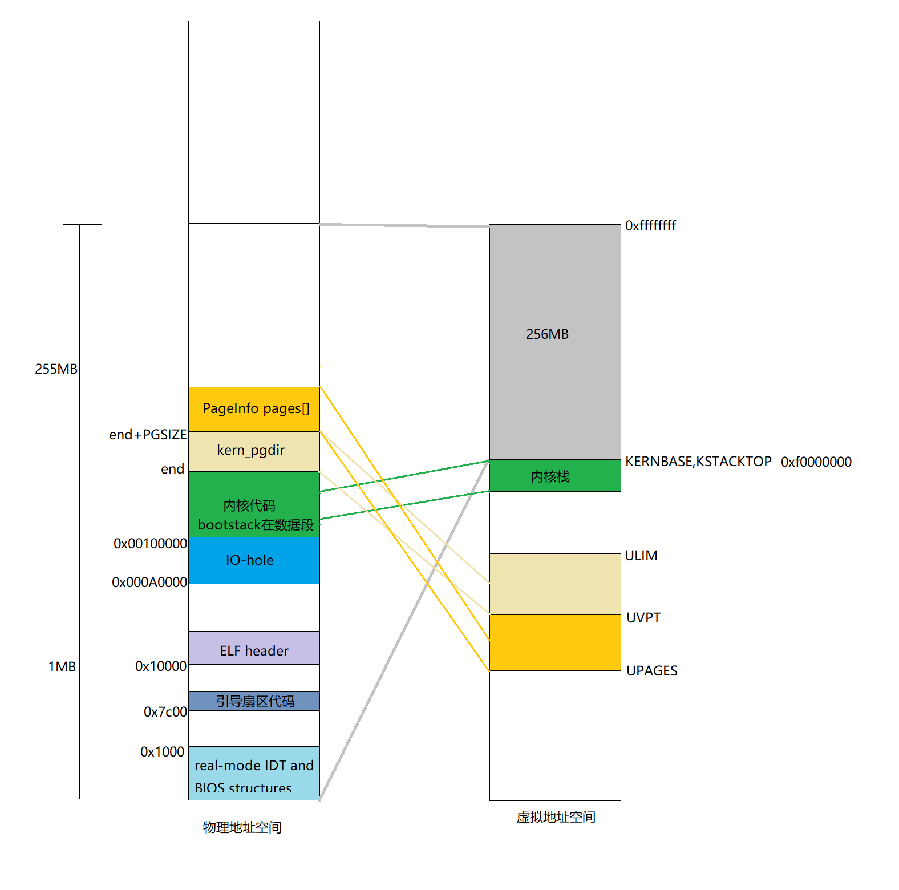

需用到的函数如下
```c++
// mmu.h
#define PTSIZE		(PGSIZE*NPTENTRIES) // page directory 4096 * 1024 = 4MB
#define PTE_W		0x002	// Writeable
#define PTE_U		0x004	// User
// memlayout.h
#define KSTACKTOP	KERNBASE  // 内核栈
#define KSTKSIZE	(8*PGSIZE)  // 内核栈空间 32KB
#define UPAGES		(UVPT - PTSIZE) // 页面结构的只读副本
```

最终，测试通过如下

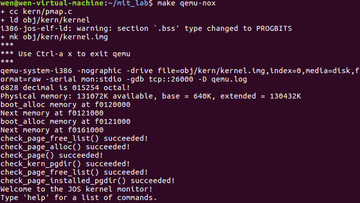

##### Question
我们已将内核和用户环境放在同一地址空间中。 为什么用户程序无法读取或写入内核的内存？ 哪些特定机制保护内核内存？

A：页表项中有读写保护位，以及PTE_U区分内核和用户，MMU应该会实现这种保护。

此操作系统可以支持的最大物理内存量是多少？ 为什么？

A：4GB，因为32位地址线，可以寻址4GB大小。

如果我们实际拥有最大的物理内存量，那么管理内存的空间开销是多少？ 这个开销是如何分解的？

A：4GB/PASIZE = $2^{32}/2^{12}$ = $2^{20}$页，每个页表项4B
```
页表占用内存2^20x4B = 4M，
page directory = 4K,
Pages结构体2^20*(4+2) = 6M
```