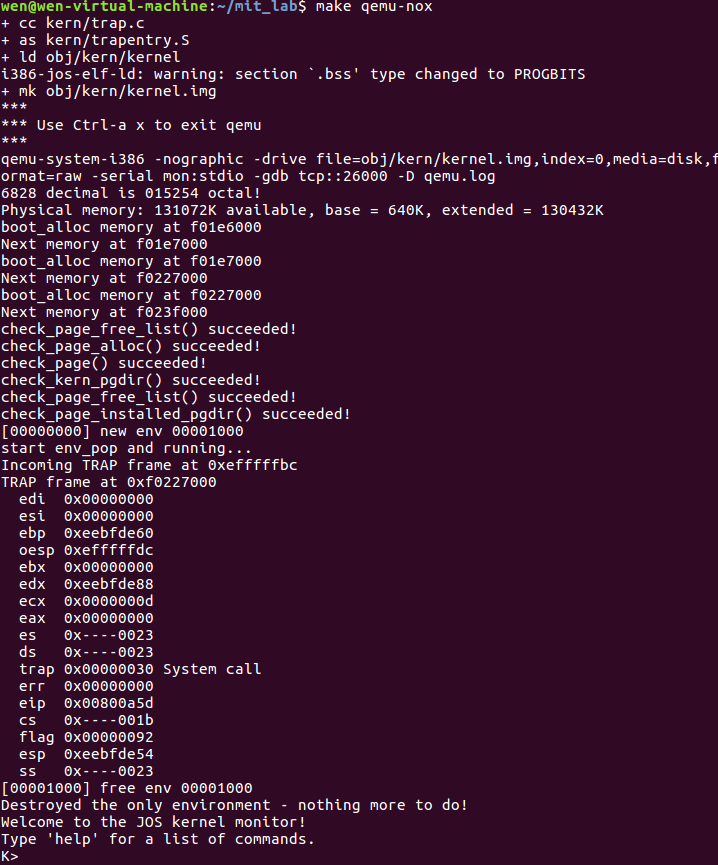

# MIT 6.828 Learning 2

##### [课程表](https://pdos.csail.mit.edu/6.828/2018/schedule.html)

##### [调试指令列表](https://pdos.csail.mit.edu/6.828/2018/labguide.html)

##### [Github参考](https://github.com/setowenGit/MIT6.828_OS)

##### [Gitee参考](https://gitee.com/rcary/mit6.828/tree/master)

##### [Github参考2](https://github.com/clpsz/mit-jos-2014/tree/master)

##### [知乎参考](https://zhuanlan.zhihu.com/p/166413604)

##### [Github参考3](https://github.com/yunwei37/6.828-2018-labs?tab=readme-ov-file)

##### [lecture的翻译笔记](https://zhuzilin.github.io/blog/tags/6-828/)

##### [CSDN参考](https://blog.csdn.net/qq_43012789?type=blog)

##### [博客园参考](https://www.cnblogs.com/fatsheep9146/p/5451579.html)
##### [实验环境配置(其他报错问题可看评论区)](https://blog.csdn.net/Rcary/article/details/125547980?utm_source=app&app_version=4.17.0)

---

## Lecture 6

[看这个笔记](https://zhuzilin.github.io/blog/6.828-note5-virtual-memory/)

在内核中使用虚拟地址（VA）的主要原因包括以下几点：

* 内存管理：通过使用虚拟地址，内核可以更灵活地管理物理内存，并实现内存映射、分页和其他高级内存管理功能
* 安全性：虚拟地址可以提供一定程度的安全保护，因为它们可以被映射到不同的物理地址，从而增加系统的安全性
* 抽象屏蔽硬件差异：使用虚拟地址可以让内核屏蔽不同硬件平台之间的差异，使得内核可以更容易地移植到不同的硬件架构上
* 如果没有page table，很容易有memory fragmentation（内存碎片？）。比如先分配64K, 释放，之后分配4K，4K占据了64K的地方，之后再分配64K就没法弄了

如果page table就仅仅是一个PTE的array，会出现什么问题呢？

* 首先是太大了，2^20条，每条32bit，整个table就会是4 MB了，这对于早期的机器太大了。并且对于一个小的程序，它不需要那么多内存，可能只需要几百page，剩下的就浪费了。所以x86使用了一个"two-level page table"以节省空间。除了在RAM中 分配PTE，还在内存中存一个叫page directory(PD)的东西。
* PD也是一个array，其每一个entry被称为PDE，我们来看一下这个PDE的结构，PDE的前20位也是一个PPN，其指向的page是一个用于存page table的page，存的每个page table会指向1024个PTE。在PD中有1024个PDE，所以就指向了2^20个PTE。
* 刚刚提到了对于一个小程序，可能不需要那么多PTE，所以有的PDE可以是invalid，从而可以让address space变得很小。

page table被存在哪里呢？
* 被存在RAM中，MMU会读取或存储PTE。操作系统可以读写PTE。

MMU如何知道page table在RAM的哪里呢？
* cr3存了PD的地址。PD里面（间接）存了PTE的PA，而这些PTE不一定是连续的。

## HW 4: xv6 lazy page allocation

 操作系统可以在页表硬件上玩的许多巧妙的把戏之一是堆内存的惰性分配。
 
 Xv6应用程序使用sbrk()系统调用向内核请求堆内存。在我们给你的内核中，sbrk()分配物理内存并将其映射到进程的虚拟地址空间。有些程序分配内存，但从不使用它，例如实现大型稀疏数组。
 
 复杂的内核会**延迟每个内存页面的分配，直到应用程序尝试使用该页面**——这是由页面错误发出的信号，内核将通过分配物理内存，将其清零并对其进行映射来处理该页面错误。在本练习中，您将把这个惰性分配特性添加到xv6中。

### Part1. Eliminate allocation from sbrk()

 修改sbrk(n)。sbrk()本来是将进程的内存大小增加n个字节，并且返回新分配区域的起始地址。现在需要改成只将进程的大小（myproc()->sz）增加n但不分配区域，并返回原来的大小

修改sysproc.c的sys_sbrk函数

 ```c++
 int
sys_sbrk(void)
{
  int addr;
  int n;

  if(argint(0, &n) < 0)
    return -1;
  addr = myproc()->sz;
  /* if(growproc(n) < 0) // 不直接分配内存
    return -1;*/ 
  myproc()->sz += n; // new add // 仅对sz进行增加
  return addr;
}
 ```

### Part2. Lazy allocation

[参考这个csdn](https://blog.csdn.net/qq_43012789/article/details/107765484)

修改trap.c中的代码，通过将新分配的物理内存页面映射到错误地址来响应用户空间的页面错误，然后返回到用户空间，让进程继续执行。在产生“pid 3 sh: trap 14”消息的cprintf调用之前添加代码。

修改trap.c的trap函数

```c++
default:
    if(myproc() == 0 || (tf->cs&3) == 0){
      // In kernel, it must be our mistake.
      cprintf("unexpected trap %d from cpu %d eip %x (cr2=0x%x)\n",
              tf->trapno, cpuid(), tf->eip, rcr2());
      panic("trap");
    }

    /*new add*/
    // char *mem;
    // uint a;
    a = PGROUNDDOWN(rcr2()); // 使用PGROUNDDOWN(va)将有问题的虚拟地址向下舍入到页面边界，得到起始虚拟地址
    for(;a<myproc()->sz;a+=PGSIZE){ // 循环遍历从起始虚拟地址开始到进程的大小（myproc()->sz）结束，每次增加一个页面大小
      mem = kalloc(); // 分配物理内存页面
      if(mem==0){ // 如果分配失败，打印错误信息并释放之前已经分配的内存，然后返回
       cprintf("allocuvm out of memory\n");
       deallocuvm(myproc()->pgdir,myproc()->sz,myproc()->tf->eax);
       return ;
      }
      memset(mem,0,PGSIZE); // 使用memset函数将分配的物理内存清零，确保数据的干净状态
      // 调用mappages函数将虚拟地址映射到物理地址，并设置相应的页表项（PTE）。如果映射失败，打印错误信息，释放内存，然后返回
      if(mappages(myproc()->pgdir,(char *)a, PGSIZE, V2P(mem), PTE_W|PTE_U)<0){
        cprintf("alloccuvm out of memory(2)\n");
        deallocuvm(myproc()->pgdir,myproc()->sz,myproc()->tf->eax);
        kfree(mem);
        return ;
      }
     // cprintf("mem\n");
    }
    break;

    // In user space, assume process misbehaved.
    cprintf("pid %d %s: trap %d err %d on cpu %d "
            "eip 0x%x addr 0x%x--kill proc\n",
            myproc()->pid, myproc()->name, tf->trapno,
            tf->err, cpuid(), tf->eip, rcr2());
    myproc()->killed = 1;
  
```

## Lecture 7

[看这个笔记](https://zhuzilin.github.io/blog/6.828-note6-using-virtual-memory/)

xv6和JOS都是OS设计的例子，但是他们和真正的OS相比还是有很大差距的，以下就是其中一些真正OS的优化

* guard page to protect against stack overflow：user stack后面放一个没有被map的page，这样如果stack overflow了，会得到page fault，当application跑到guard page上来的时候分配more stack
* one zero-filled page：观察到很多时候一些memory从来不会被写入，而因为所有的内存都会用0进行初始化，所以可以使用一个zeroed page for all zero mappings。当需要zero-filled page的时候，就map到这个zeroed page，在写入的时候，先拷贝这个公共的zeroed-filled page给另一个内存空间，然后再对这个新的内存空间进行写操作，与父子进程一开始fork后共享内存空间相似
* copy-on-write fork：很多时候都是fork之后马上exec，如果赋值了会很浪费，所以把parent和child的内存先共享着，并且把child的内存设置为copy on write，也就是有写入的时候再复制
* demanding paging：现在的exec可能会把整个文件都加载到内存中，这样会很慢，并且有可能没必要。可以先分配page，并标记为on demand，on default从file中读取对应的page
* 用比物理内存更大的虚拟内存：有的时候可能需要比物理内存还大的内存。解决方法就是把内存中不常用的部分存在硬盘上。在硬盘和内存之间 page in and out数据
  * 使用PTE来检测什么时候需要disk access
  * 用page table来找到least recent used disk block 并把其写回硬盘（LRU）
* memory-mapped files：通过load, store而不是read, write, lseek来access files以轻松访问文件的某一部分，用memory offset而不是seeking
##### The UVPD (User Virtual Page Directory)

下图和下面的代码很好的演示了如何能够找到一个虚拟地址


```
page directory = pd = lcr3();
page table = pt = *(pd + 4*PDX);
page = *(pt + 4*PTX);
```

但是这种方式我们该如何用VA来访问PD或者某一个page table呢？或者说PD和PT也应该有自己的映射才对

采用的方法是通过让PD自己指向自己，也就是两步都是指向自己的开头，在JOS中V是0x3BD（V是page directory的一个索引，里面存放的指针指向的是page directory自己）。UVPD（应该就是page directory）是 (0x3BD<<22)|(0x3BD<<12)，然后如下图：


这样如果PDX和PTX都是V，两次之后还是会指向PD，如果PDX=V但是PTX!=V，那么运行之后就会指向某一个page table。通过以上的方式，我们就把虚拟地址映射到了PD和PT了。

## HW 5: xv6 CPU alarm

在本练习中，将在xv6中添加一项功能，当进程使用CPU时间时，它会定期向进程发出警报。这对于希望限制占用多少CPU时间的受计算限制的进程，或者希望进行计算但又希望采取一些周期性操作的进程可能很有用。更一般地说，您将实现用户级中断/故障处理程序的原始形式；例如，您可以使用类似的东西来处理应用程序中的页面错误。

需要添加一个新的alarm(interval, handler)系统调用。如果一个应用程序调用了alarm(n,fn), 那么在程序消耗每个n“ticks”的CPU时间之后，内核将调用应用程序函数fn。 当fn返回时，应用程序将从中断处继续。 tick是xv6中相当随意的时间单位，由硬件定时器产生中断的频率决定。

把下述样例程序放到文件alarmtest.c中。该程序调用alarm(10，periodic)，要求内核每10秒钟强制调用periodic()，然后旋转一会儿

* 新增alarmtest.c文件

```c++
#include "types.h"
#include "stat.h"
#include "user.h"

void periodic();

int
main(int argc, char *argv[])
{
  int i;
  printf(1, "alarmtest starting\n");
  alarm(10, periodic);
  for(i = 0; i < 25*5000000; i++){
    if((i % 250000) == 0)
      write(2, ".", 1);
  }
  exit();
}

void
periodic()
{
  printf(1, "alarm!\n");
}
```

* 参考HW3,添加系统调用
  * syscall.c: extern int sys_alarm(void);
  * syscall.c: [SYS_alarm]   sys_alarm,
  * syscall.h: #define SYS_alarm  24
  * user.h:    int alarm(int, void (*)());
  * usys.S:    SYSCALL(alarm)

* sysproc.c添加函数

```c++
int
sys_alarm(void) 
{
	// 间隔 
	int interval;
	// 函数指针
	void (*handler)(void);
	
	if(argint(0, &interval) < 0)
		return -1;
	if(argptr(1, (char **)&handler, 1) < 0)
		return -1;

	myproc()->alarminterval = interval;
	myproc()->alarmhandler = handler;
	return 0;
}
```

* proc.h结构体中增加成员

```c++
int alarminterval;              
void (*alarmhandler)();
int ticks;
```

* trap.c中的trap函数增加情况

```c++
case T_IRQ0 + IRQ_TIMER:
    if(cpuid() == 0){
      acquire(&tickslock);
      ticks++;
	  
      wakeup(&ticks);
      release(&tickslock);
    }
    /*new add*/
  	if(myproc() != 0 && (tf->cs & 3) == 3){
  		myproc()->ticks++;
  		// 没有alarm任务的proc, 不会进入以下if,因为alarminterval为0
  		if(myproc()->ticks == myproc()->alarminterval) {
  			myproc()->ticks = 0;
  			tf->esp -= 4;
  			// eip压栈
  			*(uint *)(tf->esp) = tf->eip;
  			tf->eip = (uint)myproc()->alarmhandler; // 执行alarm系统调用
  	  	}
  	}
    lapiceoi();
    break;
```

运行效果如下


## Lab 3: User Environments

lab3 比 lab2 多了以下文件


在这个lab中，进程就是环境，环境就是进程
### Part A: User Environments and Exception Handling

在kern/env.c中，内核维护了与环境有关的三个主要全局变量：

```c++
#define LOG2NENV		10
#define NENV			(1 << LOG2NENV)  // 最大进程数量

struct Env *envs = NULL;		    // All environments 所有进程
struct Env *curenv = NULL;		    // The current env  现在运行的进程
static struct Env *env_free_list;	// Free environment list  空闲的进程
```

* 一旦JOS启动并运行，envs指针将指向Env代表系统中所有环境的结构数组。JOS内核将最多支持 NENV 个活动环境
* JOS内核将所有非活动Env结构保留在env_free_list上。这种设计可以轻松分配和释放环境，因为只需将它们添加到空闲列表中或从空闲列表中删除
* 内核使用该curenv符号在任何给定时间跟踪当前正在执行的环境。在启动期间，在运行第一个环境之前， curenv初始设置为NULL

在inc/env.h中，定义了结构体Env

```c++
enum {
	ENV_FREE = 0, // 空闲状态，此时进程位于env_free_list中
	ENV_DYING,    // 挂死进程，之后就会被释放
	ENV_RUNNABLE, // 就绪状态
	ENV_RUNNING,  // 正在运行状态
	ENV_NOT_RUNNABLE // 阻塞状态，如该进程正在等待某个信号量
};

enum EnvType {
	ENV_TYPE_USER = 0,
};

struct Trapframe {
	struct PushRegs tf_regs;
	uint16_t tf_es;
	uint16_t tf_padding1;
	uint16_t tf_ds;
	uint16_t tf_padding2;
	uint32_t tf_trapno;
	/* below here defined by x86 hardware */
	uint32_t tf_err;
	uintptr_t tf_eip;
	uint16_t tf_cs;
	uint16_t tf_padding3;
	uint32_t tf_eflags;
	/* below here only when crossing rings, such as from user to kernel */
	uintptr_t tf_esp;
	uint16_t tf_ss;
	uint16_t tf_padding4;
} __attribute__((packed));

struct Env {
	struct Trapframe env_tf;	// Saved registers  保存进程的寄存器现场值
	struct Env *env_link;		// Next free Env    指向env_free_list中下一个空闲的进程
	envid_t env_id;			    // Unique environment identifier  独一无二的进程ID
	envid_t env_parent_id;		// env_id of this env's parent    该进程的父进程，该进程就是由父进程fork出来的
	enum EnvType env_type;		// Indicates special system environments  进程类型
	unsigned env_status;		// Status of the environment  进程状态
	uint32_t env_runs;		    // Number of times environment has run
	// Address space
	pde_t *env_pgdir;		// Kernel virtual address of page dir 保存此进程的page directory的内核虚拟地址
};
```

* 要运行进程，内核必须使用该进程保存的寄存器和对应的地址空间设置CPU
* 在JOS中，单个环境不像xv6中的进程那样有自己的内核堆栈。内核中一次只能有一个活动的JOS环境，因此JOS只需要一个内核堆栈。

##### exercise 1

在Lab 2中，您在mem_init()中为pages[]数组分配了内存，这是一个内核用来跟踪哪些页面是空闲的，哪些不是空闲的表。您现在需要进一步修改mem_init()，以分配一个类似的Env结构数组，称为envs

修改kern/pmap.c中的mem_init()，以分配和映射envs数组。这个数组完全由分配的Env结构的NENV个实例组成，就像您分配pages数组的方式一样。和pages数组一样，内存支持envs也应该在UENVS（在inc/memlayout.h中定义）上映射用户只读，这样用户进程就可以从这个数组中读取

```c++
envs = (struct Env*)boot_alloc(sizeof(struct Env)*NENV);
memset(envs, 0, sizeof(struct Env)*NENV);

boot_map_region(kern_pgdir, UENVS, ROUNDUP((NENV * sizeof(struct Env)), PGSIZE), PADDR(envs), PTE_U);
```

##### exercise 2

现在需要在kern/env.c文件中写代码来运行用户环境。因为操作系统暂时还没有实现文件系统，所以将设置内核来加载一个静态二进制映像，它嵌入在内核本身中，每个二进制映像（也就是elf文件）被加载到不同的环境中

在kern/init.c文件中的i386_init函数中，将会看到在环境中运行其中一个二进制映像的代码。然而，设置用户环境的关键代码还不完整，需要去完成以下函数

* env_init()：初始化envs数组中的所有Env结构，并将它们添加到env_free_list中。还调用env_init_percpu，它使用特权级别0（内核）和特权级别3（用户）的单独段来配置分割硬件
* env_setup_vm()：为新环境分配一个页面目录，并初始化新环境的地址空间的内核部分
* region_alloc()：为环境分配和映射物理内存
* load_icode()：您将需要解析一个ELF二进制映像，就像boot loader已经做的那样，并将其内容加载到新环境的用户地址空间中
* env_create()：使用env_alloc分配一个环境，并调用load_icode来将一个ELF二进制文件加载到其中
* env_run()：启动以用户模式运行的给定环境

下面是代码的调用图，直到调用用户代码为止，可供参考：

* start (kern/entry.S)：kernel的entry，也就是boot loader加载kernel的entry
* i386_init (kern/init.c)：上面的entry调用了这个函数，对kernel进行初始化
  * cons_init：初始化console
  * mem_init：初始化kernel address space
  * env_init：初始化所有的环境
  * trap_init (still incomplete at this point)：初始化中断
  * env_create：创建一个用户环境
  * env_run：运行用户环境
    * env_pop_tf：从trapframe中还原这个用户环境所需要的寄存器状态

如果一切顺利，您的系统应该进入用户空间并执行hello二进制文件，直到它使用int指令进行系统调用

**env_init**：确保所有的环境envs是空闲的状态,并初始化它们的 id 为 0,接着将它们插入到 env_free_list当中,确保环境在free list中的顺序与它们在envs数组中的顺序相同（即:使第一个调用的 env_alloc()返回envs[0]）
```c++
void
env_init(void)
{
	// Set up envs array
	// LAB 3: Your code here.
	env_free_list = NULL;
  for (int i = NENV - 1; i >= 0; --i) {
      envs[i].env_id = 0;
      envs[i].env_status = ENV_FREE;
      envs[i].env_link = env_free_list;
      env_free_list = &envs[i];
  }
	// Per-CPU part of the initialization
	env_init_percpu();
}
```

**env_setup_vm**: 直接把内核的页表目录拿过来用就行，且为Page Directory分配的新page应该增加引用统计次数pp_ref，UTOP以上的地址对用户应该为可读可写的，唯独UVPT是只可读

```c++
static int
env_setup_vm(struct Env *e)
{
	int i;
	struct PageInfo *p = NULL;

	// Allocate a page for the page directory
	if (!(p = page_alloc(ALLOC_ZERO)))
		return -E_NO_MEM;

	// LAB 3: Your code here.
	e->env_pgdir = (pde_t *) page2kva(p);
    //复制内核页目录, 因为在UTOP之上与kern_pgdir是一样的，所以可以直接把kern_pgdir的内容全部拷贝过来
    memcpy((void *) e->env_pgdir, kern_pgdir, PGSIZE); 
    p->pp_ref++;

	// 唯独UVPT这个地方是不一样的，因为要放的是自己的页表目录，所以只可读
	e->env_pgdir[PDX(UVPT)] = PADDR(e->env_pgdir) | PTE_P | PTE_U;

	return 0;
}
```

**region_alloc**: 为env环境分配 len个字节物理地址内存, 并且将此物理地址映射到环境地址空间的虚拟地址va上，一个给 load_icode() 用的辅助函数，这里和 lab2 的函数原理类似

```c++
static void
region_alloc(struct Env *e, void *va, size_t len)
{
	// LAB 3: Your code here.
	// (But only if you need it for load_icode.)
	void *begin = (void *) ROUNDDOWN((uint32_t) va, PGSIZE), *end = (void *) ROUNDUP((uint32_t) va + len, PGSIZE);
    struct PageInfo *p = NULL;
    for (void *curVa = begin; curVa < end; curVa += PGSIZE) {
        p = page_alloc(ALLOC_ZERO);
		if(!p) {
          panic("region alloc error! error:%e", -E_NO_MEM);
        }
        if (page_insert(e->env_pgdir, p, curVa, PTE_U | PTE_W)) {
            panic("region alloc error! error:%e", -E_NO_MEM);
        }
    }
}
```

**load_icode**：首先需要了解ELF，Proghdr和Secthdr这三个与elf文件有关的结构体


```c++
// elf文件整体结构体
struct Elf {
	uint32_t e_magic;	 // ELF 文件的标识符，必须等于 ELF_MAGIC，用于标识文件是否为 ELF 格式
	uint8_t  e_elf[12];  // 保留的 12 字节，通常不使用
	uint16_t e_type;     // 描述 ELF 文件的类型，比如可执行文件、共享目标文件等
	uint16_t e_machine;  // 描述目标体系结构的标识符，指示了文件运行的平台
	uint32_t e_version;  // ELF 文件的版本号
	uint32_t e_entry;    // 程序的入口点（即程序启动时执行的第一条指令的地址）
	uint32_t e_phoff;    // 程序头表（Program Header Table）在文件中的偏移量，即程序头表的起始位置
	uint32_t e_shoff;    // 节头表（Section Header Table）在文件中的偏移量，即节头表的起始位置
	uint32_t e_flags;    // 特定标志的位掩码，用于描述文件的属性
	uint16_t e_ehsize;   // ELF 头的大小，以字节为单位
	uint16_t e_phentsize;// 程序头表中每个条目的大小
	uint16_t e_phnum;    // 程序头表中条目的数量
	uint16_t e_shentsize;// 节头表中每个条目的大小
	uint16_t e_shnum;    // 节头表中条目的数量
	uint16_t e_shstrndx; // 节头表中字符串表节的索引
};

// 程序头表结构体
struct Proghdr {
	uint32_t p_type;     // 段（segment）的类型，描述了段的用途和属性，比如代码段、数据段等
	uint32_t p_offset;   // 段在文件中的偏移量，即段的起始位置距文件开始的字节偏移量
	uint32_t p_va;       // 段在内存中的虚拟地址（Virtual Address），即段加载到内存后在虚拟地址空间中的地址
	uint32_t p_pa;       // 段在内存中的物理地址（Physical Address），即段加载到内存后在物理地址空间中的地址
	uint32_t p_filesz;   // 段在文件中的大小，以字节为单位
	uint32_t p_memsz;    // 段在内存中的大小，以字节为单位。通常大于等于 p_filesz，表示在内存中需要分配的空间大小
	uint32_t p_flags;    // 段的标志位，描述了段的属性，比如可读、可写、可执行等
	uint32_t p_align;    // 段在文件和内存中的对齐要求，即段在文件中和内存中的起始地址的对齐方式
};

// 节头表结构体
struct Secthdr {
	uint32_t sh_name;    // 节名称在字符串表中的偏移量或索引，用于定位节的名称
	uint32_t sh_type;    // 节的类型，描述了节的内容和属性，比如代码节、数据节、符号表节等
	uint32_t sh_flags;   // 节的标志位，描述了节的属性，比如可读、可写、可执行等
	uint32_t sh_addr;    // 节在内存中的虚拟地址，如果节在内存中被加载，则表示其在内存中的起始地址
	uint32_t sh_offset;  // 节在文件中的偏移量，即节的起始位置距文件开始的字节偏移量
	uint32_t sh_size;    // 节在文件中的大小，以字节为单位
	uint32_t sh_link;    // 与该节相关联的其他节的索引，具体含义取决于节的类型
	uint32_t sh_info;    // 额外的节信息，具体含义取决于节的类型
	uint32_t sh_addralign;// 节在文件和内存中的对齐要求，即节在文件中和内存中的起始地址的对齐方式
	uint32_t sh_entsize; // 如果节包含固定大小的条目，则为每个条目的大小；否则为 0
};
```

ELF 文件中的程序头表（Program Header Table）和节头表（Section Header Table）有以下区别：

程序头表（Program Header Table）：

* 用于描述可执行文件或可装载文件在内存中的段（segments）布局
* 包含了每个段在文件中的偏移量、大小、加载地址等信息
* 在运行时由操作系统加载，用于映射文件内容到内存
* 典型的段包括代码段、数据段、动态链接信息段等

节头表（Section Header Table）：

* 用于描述 ELF 文件中的各个节（sections）的布局和属性
* 每个节包含了特定类型的信息，如代码、数据、符号表、字符串表等
* 包含了每个节在文件中的偏移量、大小、类型等信息
* 主要用于链接器（linker）和调试器（debugger）等工具处理 ELF 文件时定位和处理各个节

```c++
static void
load_icode(struct Env *e, uint8_t *binary)
{
	// LAB 3: Your code here.
	struct Elf *elf;
    struct Proghdr *ph, *eph;

    elf = (struct Elf *) binary;
    ph = (struct Proghdr *) ((uint8_t *) elf + elf->e_phoff); // 取到第一个段
    eph = ph + elf->e_phnum; // 取到最后一个段之后

    lcr3(PADDR(e->env_pgdir)); //设置当前的页目录寄存器为 当前环境(进程)的页目录物理地址,为什么要这么做？因为下面的memset、memcpy函数默认以页目录寄存器存的值为页目录

    for (; ph < eph; ph++) {
        if (ph->p_type != ELF_PROG_LOAD) continue;
        region_alloc(e, (void *) ph->p_va, ph->p_memsz); // 为每个段分配物理内存
        memset((void *) ph->p_va, 0, ph->p_memsz); // 先全部清零
        memcpy((void *) ph->p_va, binary + ph->p_offset, ph->p_filesz); // 再把段的内容写到这个内存上
    }
    e->env_tf.tf_eip = elf->e_entry; // 配置好用户环境的内核栈,相当于就是首次运行到这个环境之后, e_entry是作为第一个要进入并执行的代码区域.(入口代码具体参考kern/entry.S文件)

    lcr3(PADDR(kern_pgdir));
	
	// Now map one page for the program's initial stack
	// at virtual address USTACKTOP - PGSIZE.
	// LAB 3: Your code here.
	region_alloc(e, (void *) (USTACKTOP - PGSIZE), PGSIZE);
}
```

**env_create**：先初始化该环境（实际是对新的环境结构体new_e的各个成员的赋值），接着调用load_icode将该环境需要运行的用户进程从elf文件中载入进内存中

```c++
void
env_create(uint8_t *binary, enum EnvType type)
{
	// LAB 3: Your code here.
	struct Env *new_e;
    int r;
    if ((r = env_alloc(&new_e, 0)) != 0)
        panic("env_alloc: %e", r);
    load_icode(new_e, binary);
    new_e->env_type = type;
}
```
其中的env_alloc对结构体指针new_e所指向的环境的各个成员进行赋值如下

```c++
e->env_parent_id = parent_id;
e->env_type = ENV_TYPE_USER;
e->env_status = ENV_RUNNABLE;
e->env_runs = 0;

// 为段寄存器设置适当的初始值.
// GD_UD是GDT中的用户数据段选择器,
// GD_UT是用户文本段选择器(见inc/memlayout.h).
// 每个段寄存器的低2位包含请求者权限级别(俗称RPL); 3表示用户模式.
// 当我们切换权限级别时,硬件会进行各种检查,涉及到RPL和描述符本身所存储的描述符权限级别（俗称DPL）
#define GD_UT     0x18     // user text
#define GD_UD     0x20     // user data
e->env_tf.tf_ds = GD_UD | 3;
e->env_tf.tf_es = GD_UD | 3;
e->env_tf.tf_ss = GD_UD | 3;
e->env_tf.tf_esp = USTACKTOP;
e->env_tf.tf_cs = GD_UT | 3;
```

**env_run**：若是进行环境切换（通过curenv是否为NULL来判断是否是环境切换，一开始没有环境运行时curenv是NULL），接着将新环境指针赋给curenv，接着将新环境的状态改为running，旧环境的状态改为runnable，再更新环境运行次数，再将页目录设为新环境的页目录，最后恢复寄存器现场

```c++
void
env_run(struct Env *e)
{
	// LAB 3: Your code here.
	if (curenv != NULL && curenv->env_status == ENV_RUNNING)
        curenv->env_status = ENV_RUNNABLE;
    curenv = e;
    curenv->env_status = ENV_RUNNING;
    curenv->env_runs++;
    lcr3(PADDR(curenv->env_pgdir));

    cprintf("start env_pop and running...\n"); // 临时加上，为了确认程序是否运行到此处

    env_pop_tf(&curenv->env_tf);
	// panic("env_run not yet implemented");
}
```

其中恢复现场的函数的实现如下

```c++
void
env_pop_tf(struct Trapframe *tf)
{
	asm volatile(
		"\tmovl %0,%%esp\n"
		"\tpopal\n"
		"\tpopl %%es\n"
		"\tpopl %%ds\n"
		"\taddl $0x8,%%esp\n" /* skip tf_trapno and tf_errcode */
		"\tiret\n"
		: : "g" (tf) : "memory");
	panic("iret failed");  /* mostly to placate the compiler */
}
```

完成后，运行操作系统，在初始化好env后，会将hello这个elf文件通过env_create函数加载到第一个环境中，该函数被宏包装后放入i386_init中

```c++
#define ENV_CREATE(x, type)						\
	do {								\
		extern uint8_t ENV_PASTE3(_binary_obj_, x, _start)[];	\
		env_create(ENV_PASTE3(_binary_obj_, x, _start),		\
			   type);					\
	} while (0)

#endif // !JOS_KERN_ENV_H

ENV_CREATE(user_hello, ENV_TYPE_USER); // 其中user_hello就是对应了hello的elf文件
```

运行后显示报错，如图


这是因为现在还没有实现中断，所以会在user_hello第一次进行system call的时候报triple fault的错。这是因为：当CPU发现它没有设置来处理这个系统调用中断，它将生成一个一般保护异常，发现它不能处理，生成一个双故障异常，发现它不能处理，最后放弃所谓的“三重故障”

但是字符串“start env_pop and running...”已经被打印，说明程序已经运行到env_run函数了，接下来就是进入env_pop_tf函数，然后进入中断，但中断现在还没实现，所以接下来就会报错

为了验证只有中断这个已知的问题，进行打断点后单步调试

将断点打在env_pop_tf函数，然后输入c快进到这个断点处，然后不断输入si单步调试，可看到后面开始出现问号 (in ??) ，表示已经出错了


##### exercise 3

阅读[《80386 Programmer's Manual》的第九章](https://pdos.csail.mit.edu/6.828/2018/readings/i386/c09.htm)了解异常和中断

[参考翻译](https://jianzzz.github.io/2017/08/26/%E5%BC%82%E5%B8%B8%E5%92%8C%E4%B8%AD%E6%96%AD/)

中断和异常的区别是，中断interrupts用于处理处理器外部的异步事件，异常exceptions用于处理处理器在执行指令时检测到的情况
* 外部中断的两个来源：
  * 可屏蔽中断Maskable interrupts，通过INTR pin来发送信号
    * 允许中断标志位IF（interrupt-enable flag）控制着是否接受经由INTR pin的外部中断信号。当IF=0，禁止INTR中断；当IF=1，允许INTR中断。处理器接收到RESET信号后，将清除IF和其他标志位
      * 显式改变IF：CLI(Clear Interrupt-Enable Flag)和STI(Set Interrupt-Enable Flag)显式改变IF
      * 隐式改变IF：1、指令PUSHF将会在栈上存储所有的标识，包括IF。2、任务切换和指令POPF、IRET将加载标志寄存器，会修改IF。3、中断门interrupt gates自动重置IF，禁止中断  
  * 不可屏蔽中断Nonmaskable interrupts，通过NMI (Non-Maskable Interrupt) pin来发送信号
    * 如果正在执行一个不可屏蔽中断的处理程序，处理器将忽略其他来自NMI pin的中断信号，直至执行IRET指令 
* 异常的两个来源：
  * 处理器检测。进一步分为故障faults、陷阱traps和中止aborts
  * 编程。指令INTO、INT 3、INT n、BOUND可以引发异常。这些指令通常被称为“软件中断”，但处理器把它们当作异常处理

异常被分为故障（Faults）、陷阱（Traps）、终止（Aborts）
* 故障：在指令开始执行之前或在指令执行期间检测到。如果在指令期间检测到故障，则报告故障，机器恢复到允许重新启动指令的状态
* 陷阱：在检测到异常的指令之后立即在指令边界报告的异常
* 终止：既不允许获取引起异常的指令的精确位置，也不允许重启导致异常的程序。终止用于报告严重的错误，比如硬件错误和不一致、系统表的非法值

处理器只在一条指令结束及下一条指令开始之际处理异常和中断。在指令边界，处理器通过某些条件和标识设置禁止某些异常和中断

> 指令边界（instruction boundaries）是在编程或计算机系统中，指令或代码段之间的分隔点或边界。这些边界可以表示不同的功能模块、程序段或代码块之间的分隔点。在程序中，指令边界的存在有助于组织和管理代码结构，提高代码的可读性、维护性和可重用性。同时，指令边界也有助于实现代码的模块化和封装，使得代码更易于理解和维护

软件经常需要使用成对的指令来改变堆栈段，比如MOV SS, AX、MOV ESP, StackTop。如果SS已经改变而ESP还未收到相应的改变的时候处理异常或中断，中断或异常处理程序执行期间栈指针SS:ESP是不一致的。为了防止这种情况的发生，80386在执行MOV SS和POP SS指令之后，在下一条指令的指令边界内禁止NMI、INTR、debug exceptions、single-step traps。但是页错误和保护错误仍可能发生，若使用80386 LSS指令，则不会出现这些问题

**异常和中断的优先级**：低优先级的异常被丢弃，低优先级的中断保持等待。在中断处理程序返回控制权的时候，被丢弃的异常将被重新发现

```
HIGHEST     Faults except debug faults (除了调试故障以外的其他故障)
  |         Trap instructions INTO, INT n, INT 3
  |         Debug traps for this instruction
  |         Debug faults for next instruction
  |         NMI interrupt
LOWEST      INTR interrupt
```

> 调试故障或陷阱是指为了调试和诊断目的而人为引入的故障或陷阱
> 
> 在实际应用中，调试陷阱（debug traps）可以通过在代码中插入**调试断点、设置条件断点或者使用特定的调试指令**来实现。当程序执行到设定的调试陷阱位置时，调试器会暂停程序执行，并提供相应的调试信息，使得程序员能够检查程序状态并进行调试

**中断描述符表**

> IDT (Interrupt Descriptor Table)：中断描述符表是用于处理中断和异常的数据结构。在 x86 架构中，IDT 是一个由中断描述符组成的表，每个中断描述符包含了处理特定中断或异常时应该跳转到的处理程序地址
> 
> GDT (Global Descriptor Table)：全局描述符表是用于管理内存分段的数据结构。在 x86 架构中，GDT 存储了系统中所有段的描述符，包括代码段、数据段、堆栈段等。每个描述符包含了段的基地址、限制、访问权限等信息
> 
> LDT (Local Descriptor Table)：局部描述符表是一种特殊的描述符表，用于存储特定进程或任务的段描述符。每个进程都可以有自己的 LDT，用于管理私有段或与其他进程隔离的段

处理器使用IDTR寄存器来定位IDT表的位置。这个寄存器中含有IDT表32位的基地址和16位的长度（限长）值。IDT表基地址应该对齐在8字节边界上以提高处理器的访问效率。限长值是以字节为单位的IDT表的长度

LIDT和SIDT指令分别用于加载和保存IDTR寄存器的内容
* LIDT用于创建IDT时的操作系统初始化代码中
* SIDT用于把IDTR中的基地址和限长内容复制到内存中


IDT可能包括3种描述符：
* Task gates（用于任务切换）
* Interrupt gates（用于处理中断请求（IRQ）和异常）
* Trap gates（用于捕获和处理一些需要在特权级别下运行的异常，如系统调用）


通用寄存器EFLAGS保存的是CPU的执行状态和控制信息，在这里只需要关注两个寄存器：IF和TF
* TF(Trap Flag)：跟踪标志。置1则开启单步执行调试模式，置0则关闭。在单步执行模式下，处理器在每条指令后产生一个调试异常，这样在每条指令执行后都可以查看执行程序的状态
* IF(Interrupt enable)：中断许可标志。控制处理器对可屏蔽硬件中断请求的响应。置1则开启可屏蔽硬件中断响应，置0则关闭。IF标志不影响异常和不可屏蔽终端NMI的产生


**中断过程**

中断门或陷阱门间接指向一个处理程序，该程序将在当前执行任务的上下文中被执行。中断门或陷阱门的选择器（selector）指向了GDT或当前LDT的一个可执行段描述符。中断门或陷阱门的偏移部分指向了中断或异常处理程序的起始位置


就像CALL指令导致控制转移一样，中断或异常处理程序的控制转移使用了栈存储了返回原先程序需要的信息。一个中断将在指针指向中断指令之前将EFLAGS进栈，如下图所示。某些异常会导致error code进栈，异常处理函数可以通过error code判断是什么异常


中断程序离开程序的方法也不同于普通程序，它将使用IRET指令离开。通过中断门或陷阱门的中断在当前TF作为EFLAGS的一部分被保存到栈后，将清零TF。通过这个动作处理器可以防止使用单步调试活动影响中断响应。随后IRET指令恢复EFLAGS在栈上的值，也恢复了TF
* 经由中断门的中断将重置IF，防止其他中断干扰当前的中断处理程序，随后IRET指令恢复EFLAGS在栈上的值
* 经由陷阱门的中断将不改变IF

任务门间接指向一个任务，任务门的选择器指向GDT的TSS描述符


经由任务门的中断或陷阱的结果是出现一个任务切换。使用一个单独任务来处理中断有两个优点：
* 整个上下文将被自动保存
* 通过LDT或页目录给予处理程序单独的地址空间，使其独立于其他任务

当80386操作系统使用中断任务时，实际上有两个调度器：软件调度器(操作系统的一部分)和硬件调度器(处理器的中断机制的一部分)。软件调度器的设计应该考虑一种情况：在启用中断时，硬件调度器随时可能派遣一个中断任务

**错误码**

当异常涉及到特定的段，处理器将异常处理程序的错误码放入栈中(无论是程序或任务)。错误码的格式如下


包含两个one-bit项：1、如果程序的外部事件导致异常，处理器设置EXT位；2、如果错误码的索引部分指向了IDT的门描述符，处理器设置I位

如果没有设置I位，TI值为0表示错误码指向GDT，TI值为1表示指向LDT。剩下的14 bits（包括TI）是段选择符的高14位

**异常情况**

故障：当故障被报告时，导致故障的指令的CS和EIP值将被保存

陷阱：当陷阱被报告时，导致陷阱的指令的下一条动态指令的CS和EIP值将被保存（例如，执行JMP指令时发现陷阱，CS和EIP的值指向JMP的目标）

**重要的中断或异常**

中断和异常都被分配有中断号，与其在IDT表中的索引一一对应，下面将根据中断号列出

###### （1）Interrupt 0 – Divide Error

属于故障fault，在执行DIV或IDIV指令时，如果除数为0则出现该故障

###### （2） Interrupt 1 – Debug Exceptions

处理器触发调试异常的情况有很多种，该异常是故障还是陷阱取决于具体的情况：
* 指令地址断点 —— 故障fault
* 数据地址断点 —— 陷阱trap
* 一般检测 —— 故障fault
* 单步调试 —— 陷阱trap
* 任务切换断点 —— 陷阱trap

处理器不会将该异常的错误码进栈，异常处理程序可以通过检查调试寄存器来确定是哪些条件引起异常

###### （3）Interrupt 3 – Breakpoint

INT 3指令导致该陷阱trap，可在一个可执行段将一个操作码替换为断点操作码，CS:EIP保存的值指向了断点的后续字节

###### （4）Interrupt 4 – Overflow

当处理器遇到INTO指令并且设置了溢出标志OF时，引发该陷阱trap

###### （5）Interrupt 5 – Bounds Check

当处理器在执行BOUND指令并发现操作数超过指定的限制的时候，引发该故障fault

###### （6）Interrupt 6 – Invalid Opcode

如果在可执行单元中发现了无效的操作码，引发该故障fault

###### （7）Interrupt 7 – Coprocessor Not Available

* 处理器遇到ESC(逃避escape)指令，且设置了CR0(control register zero)的EM(模拟emulate)位
* 处理器遇到WAIT指令或ESC指令，且设置了CR0的MP(监控协处理器monitor coprocessor)和TS(任务切换task switched)位

###### （8）Interrupt 8 – Double Fault

当处理器试图调用异常处理程序处理之前的异常时又检测到异常，可以连续处理这两个异常。如果处理器不能串行处理它们，将会发出一个double-fault异常

###### （9）Interrupt 9 – Coprocessor Segment Overrun

在保护模式下，如果在传递协处理器操作数的中间部分到NPX的过程中80386检测到页面或段非法，将引发该异常

###### （10）Interrupt 10 – Invalid TSS

当任务切换期间新TSS是非法的将引发该异常。异常停留在原始任务的上下文中直到处理器完全验证新TSS的存在。为了确保有合适的TSS，Interrupt 10的处理程序必须是经由任务门调用的一个任务

###### （11）Interrupt 11 – Segment Not Present

当处理器发现描述符的存在位为0时引发该故障fault

###### （12）Interrupt 12 – Stack Exception

以下两种情况一般会触发栈故障fault：

* 引用SS寄存器的任何操作由于违反限制的结果。包括POP、PUSH、ENTER、LEAVE，以及其他隐式使用SS的内存引用操作，如MOV AX, [BP+6]。当栈空间太小不满足局部变量空间时，ENTER引发该故障
* 描述符有效但被标记为不存在的情况下尝试加载SS寄存器，引发该故障。这种情况可能发生在任务切换、interlevel CALL、interlevel return、LSS指令，或者针对SS的MOV或POP指令

###### （13）Interrupt 13 – General Protection Exception

所有不会导致其他异常的保护违反都会导致通用保护异常，属于故障fault

###### （14）Interrupt 14 – Page Fault

允许分页的情况下，处理器在将线性地址转换为物理地址的过程中如果发现以下情况将会引发页错误：
* 地址转换涉及到的页目录项或页表项的存在位为0
* 当前程序没有权限访问该物理页

处理器为该异常处理程序提供两种信息用于诊断和恢复：

* 保存到栈上的错误码：错误码告知异常处理程序三件事：（1）异常是由于页面不存在还是违反访问权限所引起的；（2）发生异常的时间点上处理器是在用户级别还是supervisor级别；（3）引起异常的内存访问是写操作还是读操作。


* CR2：处理器将因访问内存而引起异常的线性地址保存到CR2中，异常处理程序可以根据该地址定位到页目录项和页表项。如果在页面错误处理程序执行期间出现了另一个页面错误，异常处理程序应该将CR2保存到栈上

任务切换期间，处理器可能访问四个部分：
* 在原先任务的TSS上保存原先任务的状态
* 读取GDT，定位新任务的TSS描述符
* 读取新任务的TSS，检查来源于TSS的段描述符的类型
* 可能读取新任务的LDT，用于验证保存到新TSS上的段寄存器。

上述任何一种情况都可能导致页错误。后两种情况的页错误发生在新任务的上下文中


##### exercise 4

让我们看一个实例，假设处理器正在用户状态下运行代码，但是遇到了一个除法指令，并且除数为0

1. 处理器会首先切换自己的堆栈，切换到由TSS的SS0，ESP0字段所指定的内核堆栈区，这两个字段分别存放着GD_KD（全局描述符，用于描述内核数据段）和KSTACKTOP（内核栈的栈顶地址）的值
2. 处理器把异常参数压入到内核堆栈中，起始于地址KSTACKTOP：


3. 因为我们要处理的是除零异常，它的中断向量是0，处理器会读取IDT表中的0号表项，并且把CS:EIP的值设置为0号中断处理函数的地址值
4. 中断处理函数开始执行，并且处理中断

对于某些特定的异常，除了上面图中要保存的五个值之外，还要再压入一个字，叫做错误码。比如页表错，就是其中一个实例。当压入错误码之后，内核堆栈的状态如下：


以上几步都是由硬件自动完成的

处理器在用户态下和内核态下都可以处理异常或中断。只有当处理器从用户态切换到内核态时，才会自动地切换堆栈，并且把一些寄存器中的原来的值压入到堆栈上，并且触发相应的中断处理函数。但如果处理器已经由于正在处理中断而处在内核态下时，此时CPU只会向内核堆栈压入更多的值。通过这种方式，内核就可处理嵌套中断

如果处理器已经在内核态下并且遇到嵌套中断，因为它不需要切换堆栈，所以它不需要存储SS，ESP寄存器的值。此时内核堆栈的就像下面这个样子：


这里有一个重要的警告。如果处理器在内核态下接受一个异常，而且由于一些原因，比如堆栈空间不足，不能把当前的状态信息（寄存器的值）压入到内核堆栈中时，那么处理器是无法恢复到原来的状态了，它会自动重启

你现在应该有了所有的基本信息去设置IDT表，并且在JOS处理异常。现在你只需要处理内部异常（中断向量号0~31）

在头文件 inc/trap.h和kern/trap.h 中包含了和中断异常相关的非常重要的定义，你应该好好熟悉一下。kern/trap.h 文件中包含了仅内核可见的一些定义， inc/trap.h 中包含了用户态也可见的一些定义

最后你要实现的代码的效果如下：


每一个中断或异常都有它自己的中断处理函数，分别定义在 trapentry.S中，trap_init()将初始化IDT表。每一个处理函数都应该构建一个结构体 Trapframe 在堆栈上，并且调用trap()函数指向这个结构体，trap()然后处理异常/中断，给他分配一个中断处理函数

所以整个操作系统的中断控制流程为：

1. trap_init() 先将所有中断处理函数的起始地址放到中断向量表IDT中
2. 当中断发生时，不管是外部中断还是内部中断，处理器捕捉到该中断，进入核心态，根据中断向量去查询中断向量表，找到对应的表项
3. 保存被中断的程序的上下文到内核堆栈中，调用这个表项中指明的中断处理函数
4. 执行中断处理函数
5. 执行完成后，恢复被中断的进程的上下文，返回用户态，继续运行这个进程

编辑一下trapentry.S 和 trap.c 文件，并且实现上面所说的功能。宏定义 TRAPHANDLER 和 TRAPHANDLER_NOEC 会对你有帮助。你将会在 trapentry.S文件中为在inc/trap.h文件中的每一个trap加入一个入口指， 你也将会提供_alttraps的值

你需要修改trap_init()函数来初始化idt表，使表中每一项指向定义在trapentry.S中的入口指针，SETGATE宏定义在这里用得上

**首先看trap.h**

kern/trap.h中：包含了仅内核可见的idt表和与中断异常有关的函数接口

```c++
extern struct Gatedesc idt[];
extern struct Pseudodesc idt_pd;

void trap_init(void);
void trap_init_percpu(void);
void print_regs(struct PushRegs *regs);
void print_trapframe(struct Trapframe *tf);
void page_fault_handler(struct Trapframe *);
void backtrace(struct Trapframe *);
```

inc/trap.h中：包含了不同中断或异常所对应的中断号，保存现场情况的结构体Trapframe的定义

```c++
// Trap numbers
// These are processor defined:
#define T_DIVIDE     0		// divide error
#define T_DEBUG      1		// debug exception
#define T_NMI        2		// non-maskable interrupt
#define T_BRKPT      3		// breakpoint
#define T_OFLOW      4		// overflow
#define T_BOUND      5		// bounds check
#define T_ILLOP      6		// illegal opcode
#define T_DEVICE     7		// device not available
#define T_DBLFLT     8		// double fault
/* #define T_COPROC  9 */	// reserved (not generated by recent processors)
#define T_TSS       10		// invalid task switch segment
#define T_SEGNP     11		// segment not present
#define T_STACK     12		// stack exception
#define T_GPFLT     13		// general protection fault
#define T_PGFLT     14		// page fault
/* #define T_RES    15 */	// reserved
#define T_FPERR     16		// floating point error
#define T_ALIGN     17		// aligment check
#define T_MCHK      18		// machine check
#define T_SIMDERR   19		// SIMD floating point error

// These are arbitrarily chosen, but with care not to overlap
// processor defined exceptions or interrupt vectors.
#define T_SYSCALL   48		// system call
#define T_DEFAULT   500		// catchall

#define IRQ_OFFSET	32	// IRQ 0 corresponds to int IRQ_OFFSET

// Hardware IRQ numbers. We receive these as (IRQ_OFFSET+IRQ_WHATEVER)
#define IRQ_TIMER        0
#define IRQ_KBD          1
#define IRQ_SERIAL       4
#define IRQ_SPURIOUS     7
#define IRQ_IDE         14
#define IRQ_ERROR       19
```

**接着看SETGATE定义**

在inc/mmu.h中

```c++
// gate是IDT表的索引入口，istrap:1代表exception，0代表trap
// sel是代码段选择子，off是代码段偏移，dpl是描述符特权级
#define SETGATE(gate, istrap, sel, off, dpl)			\
{								\
	(gate).gd_off_15_0 = (uint32_t) (off) & 0xffff;		\
	(gate).gd_sel = (sel);					\
	(gate).gd_args = 0;					\
	(gate).gd_rsv1 = 0;					\
	(gate).gd_type = (istrap) ? STS_TG32 : STS_IG32;	\
	(gate).gd_s = 0;					\
	(gate).gd_dpl = (dpl);					\
	(gate).gd_p = 1;					\
	(gate).gd_off_31_16 = (uint32_t) (off) >> 16;		\
}
```

**修改trap_init函数**

在kern/trap.c中trap_init()中添加初始化IDT表中各个中断，其中带handler后缀的就是中断入口，GD_KD表示内核数据段

```c++
// GD_KT 全局描述符， kernel text
SETGATE(idt[T_DIVIDE], 0, GD_KT, divide_handler, 0);
SETGATE(idt[T_DEBUG],  0, GD_KT, debug_handler,  0);
SETGATE(idt[T_NMI],    0, GD_KT, nmi_handler,    0);
SETGATE(idt[T_BRKPT],  0, GD_KT, brkpt_handler,  3); // 注意DPL要设置为3，不然后面的breakpoint练习会报错
SETGATE(idt[T_OFLOW],  0, GD_KT, oflow_handler,  0);
SETGATE(idt[T_BOUND],  0, GD_KT, bound_handler,  0);
SETGATE(idt[T_DEVICE], 0, GD_KT, device_handler, 0);
SETGATE(idt[T_ILLOP],  0, GD_KT, illop_handler,  0);
SETGATE(idt[T_DBLFLT], 0, GD_KT, dblflt_handler, 0);
SETGATE(idt[T_TSS],    0, GD_KT, tss_handler,    0);
SETGATE(idt[T_SEGNP],  0, GD_KT, segnp_handler,  0);
SETGATE(idt[T_STACK],  0, GD_KT, stack_handler,  0);
SETGATE(idt[T_GPFLT],  0, GD_KT, gpflt_handler,  0);
SETGATE(idt[T_PGFLT],  0, GD_KT, pgflt_handler,  0);
SETGATE(idt[T_FPERR],  0, GD_KT, fperr_handler,  0);
SETGATE(idt[T_ALIGN],  0, GD_KT, align_handler,  0);
SETGATE(idt[T_MCHK],   0, GD_KT, mchk_handler,   0);
SETGATE(idt[T_SIMDERR], 0, GD_KT, simderr_handler, 0);
SETGATE(idt[T_SYSCALL], 0, GD_KT, syscall_handler, 3);
```

**修改trapentry.S**

在 trapentry.S文件中为在inc/trap.h文件中的每一个trap加入一个入口指针

TRAPHANDLER 和 TRAPHANDLER_NOEC都是将中断号入栈，后跳转到_alltraps去执行

* 这两个宏的差别在于执行的trap是否有error code, 参考官方给出的参考手册可以获知
* TRAPHANDLER会在中断号入栈前先将error code入栈
* TRAPHANDLER_NOEC会用0代替error code，并在中断号入栈前先入栈

```c++
TRAPHANDLER_NOEC(divide_handler, T_DIVIDE);
TRAPHANDLER_NOEC(debug_handler, T_DEBUG);
TRAPHANDLER_NOEC(nmi_handler, T_NMI);
TRAPHANDLER_NOEC(brkpt_handler, T_BRKPT);
TRAPHANDLER_NOEC(oflow_handler, T_OFLOW);
TRAPHANDLER_NOEC(bound_handler, T_BOUND);
TRAPHANDLER_NOEC(illop_handler, T_ILLOP);
TRAPHANDLER_NOEC(device_handler, T_DEVICE);
TRAPHANDLER(dblflt_handler, T_DBLFLT);
TRAPHANDLER(tss_handler, T_TSS);
TRAPHANDLER(segnp_handler, T_SEGNP);
TRAPHANDLER(stack_handler, T_STACK);
TRAPHANDLER(gpflt_handler, T_GPFLT);
TRAPHANDLER(pgflt_handler, T_PGFLT);
TRAPHANDLER_NOEC(fperr_handler, T_FPERR);
TRAPHANDLER(align_handler, T_ALIGN);
TRAPHANDLER_NOEC(mchk_handler, T_MCHK);
TRAPHANDLER_NOEC(simderr_handler, T_SIMDERR);
TRAPHANDLER_NOEC(syscall_handler, T_SYSCALL);
```

你所实现的 _alltraps 应该：

* 把值压入堆栈使堆栈看起来像一个结构体 Trapframe
* 加载 GD_KD 的值到 %ds, %es寄存器中
* 把%esp的值压入，并且传递一个指向Trapframe的指针到trap()函数中
* 调用trap

需要对照Trapframe结构体（在inc/trap.h里）里每个成员的定义顺序来决定入栈顺序，压入堆栈的顺序是从下到上

* ss,esp已经存在在堆栈里了，cs, eip等通过硬件压入，剩下只有ds,es和tf_regs，因此通过pushl依次压入ds和es
* pushal 指令将所有通用寄存器 (%eax, %ecx, %edx, %ebx, %esp, %ebp, %esi, %edi) 的值压入栈中，因此使用pushal压入的是tf_regs

```c++
// inc/trap.h
struct PushRegs {
	/* registers as pushed by pusha */
	uint32_t reg_edi;
	uint32_t reg_esi;
	uint32_t reg_ebp;
	uint32_t reg_oesp;		/* Useless */
	uint32_t reg_ebx;
	uint32_t reg_edx;
	uint32_t reg_ecx;
	uint32_t reg_eax;
} __attribute__((packed));

struct Trapframe {
	struct PushRegs tf_regs;
	uint16_t tf_es;
	uint16_t tf_padding1;
	uint16_t tf_ds;
	uint16_t tf_padding2;
	uint32_t tf_trapno;
	/* below here defined by x86 hardware */
	uint32_t tf_err;
	uintptr_t tf_eip;
	uint16_t tf_cs;
	uint16_t tf_padding3;
	uint32_t tf_eflags;
	/* below here only when crossing rings, such as from user to kernel */
	uintptr_t tf_esp;
	uint16_t tf_ss;
	uint16_t tf_padding4;
} __attribute__((packed));


// trapentry.S
.globl _alltraps
_alltraps:
	pushl %ds;
	pushl %es;
	pushal;
  // 将一个段选择子（这里是 GD_KD）加载到 AX 寄存器，然后将其值加载到 DS 和 ES 寄存器中。这样做的目的是将数据段寄存器设置为内核数据段
	movw $GD_KD, %ax;
	movw %ax, %ds;
	movw %ax, %es;
  // 将当前栈指针 %esp 的值压入栈中。这是为了将当前堆栈的地址作为参数传递给下一个调用的函数
	pushl %esp;        
	call trap
```

**最后检验**

可看出已经不会报tripple fault了



**Question**

1. 为每个异常/中断提供单独的处理函数的目的是什么？ （即，如果所有异常/中断都传递给同一个处理程序，则无法提供当前实现中存在的哪些功能？）

答：不同的中断或者异常当然需要不同的中断处理函数，因为不同的异常/中断可能需要不同的处理方式，比如有些异常是代表指令有错误，则不会返回被中断的命令。而有些中断可能只是为了处理外部IO事件，此时执行完中断函数还要返回到被中断的程序中继续运行。

2. 为什么用户态下中的中断14会进入中断向量13？

答：因为当前的系统正在运行在用户态下，特权级为3，而INT指令为系统指令，特权级为0。特权级为3的程序不能直接调用特权级为0的程序，会引发一个General Protection Exception，即trap 13

### Part B: Page Faults, Breakpoints Exceptions, and System Calls

##### exercise 5

缺页中断（中断号14）是一个非常重要的中断，因为我们在后续的实验中，非常依赖于能够处理缺页中断的能力。当缺页中断发生时，系统会把引起中断的线性地址存放到控制寄存器 CR2 中。在trap.c 中，已经提供了一个能够处理这种缺页异常的函数page_fault_handler()

修改一下 trap_dispatch 函数，使系统能够把缺页异常引导到 page_fault_handler() 上执行。在修改完成后，运行 make grade，出现的结果应该是你修改后的 JOS 可以成功运行 faultread，faultreadkernel，faultwrite，faultwritekernel 测试程序

也可以使用make run-x或make run-x-nox将JOS引导到特定的用户程序中。例如，让make run-hello-nox运行hello用户程序

根据 trapentry.S 文件中的 TRAPHANDLER 函数可知，这个函数会把当前中断的中断码压入堆栈中，再根据 inc/trap.h 文件中的 Trapframe 结构体我们可以知道，Trapframe 中的 tf_trapno 成员代表这个中断的中断码。所以在 trap_dispatch 函数中我们需要根据输入的 Trapframe 指针 tf 中的 tf_trapno 成员来判断到来的中断是什么中断，这里我们需要判断是否是缺页中断，如果是则执行 page_fault_handler 函数

```c++
// kern/trap.c
switch(tf->tf_trapno) { 
  case (T_PGFLT):
      page_fault_handler(tf);
      break; 
   default:
      // Unexpected trap: The user process or the kernel has a bug.
      print_trapframe(tf);
      if (tf->tf_cs == GD_KT)
          panic("unhandled trap in kernel");
      else {
          env_destroy(curenv);
          return;
      }
}
```

执行```make grade```，可看到四个测试程序都通过


##### exercise 6

断点异常，异常号为3，这个异常可以让调试器能够给程序加上断点。加断点的基本原理就是把要加断点的语句用一个 INT3 指令替换，执行到INT3时，会触发软中断。在JOS中，我们将通过把这个异常转换成一个伪系统调用，这样的话任何用户环境都可以使用这个伪系统调用来触发JOS kernel monitor

修改trap_dispatch()使断点异常发生时，能够触发kernel monitor

与上面的练习同理，在trap_dispatch函数中增加断点中断即可

```c++
// kern/trap.c
  case (T_BRKPT):
      monitor(tf); // 调出shell的monitor
	  break;

// kern/monitor.c
void

monitor(struct Trapframe *tf)
{
	char *buf;
	cprintf("Welcome to the JOS kernel monitor!\n");
	cprintf("Type 'help' for a list of commands.\n");
	if (tf != NULL)
		print_trapframe(tf);
	while (1) {
		buf = readline("K> ");
		if (buf != NULL)
			if (runcmd(buf, tf) < 0)
				break;
	}
}
```

执行```make grade```，可看到breakpoint测试程序通过


**Question**

在上面的break point exception测试程序中，如果你在设置IDT时，对break point exception采用不同的方式进行设置，可能会产生触发不同的异常，有可能是break point exception，有可能是 general protection exception。这是为什么？你应该怎么做才能得到一个我们想要的breakpoint exception，而不是general protection exception？

答：通过实验发现出现这个现象的问题就是在设置IDT表中的breakpoint exception的表项时，如果我们把表项中的DPL字段设置为3，则会触发break point exception，如果设置为0，则会触发general protection exception。

DPL字段代表的含义是段描述符优先级（Descriptor Privileged Level），如果我们想要当前执行的程序能够跳转到这个描述符所指向的程序哪里继续执行的话，有个要求，就是要求当前运行程序的CPL，RPL的最大值需要小于等于DPL，否则就会出现优先级低的代码试图去访问优先级高的代码的情况，就会触发general protection exception。

我们的测试程序首先运行于用户态，它的CPL为3，当异常发生时，它希望去执行 int 3指令，这是一个系统级别的指令，用户态命令的CPL一定大于 int 3 的DPL=0，所以就会触发general protection exception，但是如果把IDT这个表项的DPL设置为3时，就不会出现这样的现象了，这时如果再出现异常，肯定是因为我们还没有编写处理break point exception的程序所引起的，所以是break point exception

##### exercise 7

用户程序会要求内核帮助它完成系统调用。当用户程序触发系统调用，系统进入内核态。处理器和操作系统将保存该用户程序当前的上下文状态，然后由内核将执行正确的代码完成系统调用，然后回到用户程序继续执行

在JOS中，我们会采用int指令，这个指令会触发一个处理器的中断。特别的，我们用```int $0x30```来代表系统调用中断。注意，中断0x30不是通过硬件产生的

应用程序会把系统调用号以及系统调用的参数放到寄存器中。通过这种方法，内核就不需要去查询用户程序的堆栈了。系统调用号存放到 %eax 中，参数则存放在 %edx, %ecx, %ebx, %edi, 和 %esi 中。内核会把返回值送到 %eax中

给中断向量T_SYSCALL编写一个中断处理函数

**检查 inc/trap.h, kern/trap.c 和 trapentry.S**

在上述三个文件中都已存在与T_SYSCALL相关的定义

```c++
// inc/trap.h
#define T_SYSCALL   48
// kern/trap.c
void syscall_handler();
SETGATE(idt[T_SYSCALL], 0, GD_KT, syscall_handler, 3);
// trapentry.S
TRAPHANDLER_NOEC(syscall_handler, T_SYSCALL);
```

**两个syscall.c**

存在两个syscall.c文件，分别为 kern/syscall.c 和 lib/syscall.c，其中都含有syscall函数，如下

* 当程序在内核态时，就是运行kern/这个目录下的文件，反之，如果是在lib下，就是在用户态下会运行的文件
* 前者处理系统调用的具体实现，后者提供对系统调用的用户态接口
* 如果现在运行的是内核态的程序的话，此时调用了一个系统调用，比如 sys_cputs 函数时，此时不会触发中断，系统直接执行定义在kern/syscall.c 文件中的 sys_cputs
* 当程序运行在用户态下，进行系统调用，其中的汇编代码就通过INT指令产生软件中断，程序陷入内核执行。之前已经设置到了SYSCALL的中断处理入口，然后我们就是要在trap_dispatch函数中进行相应的中断处理

```c++
// kern/syscall.c
syscall(uint32_t syscallno, uint32_t a1, uint32_t a2, uint32_t a3, uint32_t a4, uint32_t a5)
// lib/syscall.c
syscall(int num, int check, uint32_t a1, uint32_t a2, uint32_t a3, uint32_t a4, uint32_t a5)
```

**修改trap_dispatch函数**

在kern/trap.c中

```c++
case T_SYSCALL:
			tf->tf_regs.reg_eax = syscall(tf->tf_regs.reg_eax, 
											tf->tf_regs.reg_edx, 
											tf->tf_regs.reg_ecx, 
											tf->tf_regs.reg_ebx, 
											tf->tf_regs.reg_edi, 
											tf->tf_regs.reg_esi);
			break;
```

**修改syscall函数**

在 kern/syscall.c 中

```c++
int32_t
syscall(uint32_t syscallno, uint32_t a1, uint32_t a2, uint32_t a3, uint32_t a4, uint32_t a5)
{
	switch (syscallno) {
	case SYS_cputs:
		sys_cputs((const char*)a1,a2);
	        break;
	case SYS_cgetc:
	       return  sys_cgetc();
	case SYS_getenvid:
                return sys_getenvid();
	case SYS_env_destroy:
		return sys_env_destroy(a1);
 
	default:
		return -E_INVAL;
	}
	return 0;
}
```

输入命令```make run-hello```如下，在控制台上打印“hello world”，然后在用户模式下导致页面错误


输入命令```make grade```，现在testbss可以通过


##### exercise 8

用户程序真正开始运行的地方是在lib/entry.S文件中。该文件中，首先会进行一些设置，然后就会调用lib/libmain.c 文件中的 libmain() 函数。你首先要修改一下 libmain() 函数，使它能够初始化全局指针 thisenv ，让它指向当前用户环境的 Env 结构体

然后 libmain() 函数就会调用 umain，这个 umain 程序恰好是 user/hello.c 中被调用的函数。在之前的实验中我们发现，hello.c程序只会打印 "hello, world" 这句话，然后就会报出 page fault 异常，原因就是 thisenv->env_id 这条语句，在 user/hello.c 中打印"hello, world"后会调用thisenv

```c++
cprintf("i am environment %08x\n", thisenv->env_id);
```

把我们刚刚提到的应该补全的代码补全，然后重新启动内核，此时你应该看到 user/hello 程序会打印 "hello, world", 然后在打印出来 "i am environment 00001000"。user/hello 然后就会尝试退出，通过调用 sys_env_destroy()。由于内核目前仅仅支持一个用户运行环境，所以它应该汇报 “已经销毁用户环境”的消息，然后退回内核监控器(kernel monitor)

其实就是让你通过程序获得当前正在运行的用户环境的 env_id , 以及这个用户环境所对应的 Env 结构体的指针
* env_id 我们可以通过调用 sys_getenvid() 这个函数来获得
* 通过阅读 inc/env.h 文件我们知道，env_id的值包含三部分，第31位被固定为0；第10—30这21位是标识符，标示这个用户环境；第0—9位代表这个用户环境所采用的 Env 结构体，在envs数组中的索引。所以我们只需知道 env_id 的低 0—9 位，我们就可以获得这个用户环境对应的 Env 结构体了

```
An environment ID 'envid_t' has three parts:
+1+---------------21-----------------+--------10--------+
|0|          Uniqueifier             |   Environment    |
| |                                  |      Index       |
+------------------------------------+------------------+
                                      \--- ENVX(eid) --/
```

**修改libmain函数**

在 lib/libmian.c 文件中给 thisenv 赋值当前环境的Env结构体在 envs 中的索引即可

```c++
void
libmain(int argc, char **argv)
{
	// set thisenv to point at our Env structure in envs[].
	// LAB 3: Your code here.
	thisenv = &envs[ENVX(sys_getenvid())];
	// save the name of the program so that panic() can use it
	if (argc > 0)
		binaryname = argv[0];
	// call user main routine
	umain(argc, argv);
	// exit gracefully
	exit();
}
```
输入命令```make run-hello```后现在能够打印出“i am environment ...”的字符串


输入命令```make grade```，可发现hello测试通过


##### exercise 9

内存保护是操作系统的非常重要的一项功能，让我们考虑一下可自动扩展的堆栈。在许多系统中，内核在初始情况下只会分配一个内核堆栈页，如果程序想要访问这个内核堆栈页之外的堆栈空间的话，就会触发异常，此时内核会自动再分配一些页给这个程序，程序就可以继续运行了

系统调用也为内存保护带来了问题。大部分系统调用接口让用户程序传递一个指针参数给内核。这些指针指向的是用户缓冲区。通过这种方式，系统调用在执行时就可以解引用这些指针。但是这里有两个问题：

* 在内核中的page fault要比在用户程序中的page fault更严重。如果内核在操作自己的数据结构时出现 page faults，这是一个内核的bug，而且异常处理程序会中断整个内核。但是当内核在解引用由用户程序传递来的指针时，它需要一种方法去记录此时出现的任何page faults都是由用户程序带来的
* 内核通常比用户程序有着更高的内存访问权限。用户程序很有可能要传递一个指针给系统调用，这个指针指向的内存区域是内核可以进行读写的，但是用户程序不能。此时内核必须小心不要去解析这个指针，否则的话内核的重要信息很有可能被泄露

现在你需要通过仔细检查所有由用户传递来指针所指向的空间来解决上述两个问题

**修改page_fault_handler函数**

首先我们应该根据 CS 段寄存器的低2位来判断当前运行的程序时处在内核态下还是用户态下，这两位的名称叫做 CPL 位，表示当前运行的代码的访问权限级别
* 0代表是内核态
* 3代表是用户态

题目要求我们在检测到这个 page fault 是出现在内核态时，要把这个事件 panic 出来

在 kern/trap.c 的page_fault_handler函数中加入

```c++
if((tf->tf_cs & 3) == 0) {
    panic("page_fault in kernel mode, fault address %d\n", fault_va);
}
```

**修改user_mem_check函数**

然后根据题目的要求，我们还要继续完善 kern/pmap.c 文件中的 user_mem_assert , user_mem_check 函数，通过观察 user_mem_assert 函数我们发现，它调用了 user_mem_check 函数

user_mem_check 函数的功能是检查一下当前用户态程序是否有对虚拟地址空间 ```[va, va+len]``` 的 ```perm | PTE_P``` 访问权限

我们要做的事情应该是，先找到这个虚拟地址范围对应于当前用户态程序的页表中的页表项，然后再去看一下这个页表项中有关访问权限的字段，是否包含 ```perm | PTE_P```，只要有一个页表项是不包含的，就代表程序对这个范围的虚拟地址没有 ```perm | PTE_P``` 的访问权限

```c++
int
user_mem_check(struct Env *env, const void *va, size_t len, int perm)
{
	// LAB 3: Your code here.
	uint32_t start = (uint32_t)ROUNDDOWN((char *)va, PGSIZE);
	uint32_t end = (uint32_t)ROUNDUP((char *)va+len, PGSIZE);
	for(; start < end; start += PGSIZE) {
		pte_t *pte = pgdir_walk(env->env_pgdir, (void*)start, 0);
		if((start >= ULIM) || (pte == NULL) || !(*pte & PTE_P) || ((*pte & perm) != perm)) {
			user_mem_check_addr = (start < (uint32_t)va ? (uint32_t)va : start);
			return -E_FAULT;
		}
	}
	return 0;
}
```

**补全sys_cputs函数**

最后按照题目要求我们还要补全 kern/syscall.c 文件中的一部分内容，即 sys_cputs 函数，这个函数要求检查用户程序对虚拟地指空间 ```[s, s+len]``` 是否有访问权限，所以我们恰好可以使用函数  user_mem_assert() 来实现

```c++
static void
sys_cputs(const char *s, size_t len)
{
	// Check that the user has permission to read memory [s, s+len).
	// Destroy the environment if not.
	// LAB 3: Your code here.
	user_mem_assert(curenv, (const void *) s, len, 0);
	// Print the string supplied by the user.
	cprintf("%.*s", len, s);
}
```

启动内核后，运行 user/buggyhello 程序，输入命令```make run-buggyhello```，用户环境可以被销毁，内核不可以panic，你应该看到


输入命令```make grade```，可发现 buggyhello 和 evilhello 测试通过

