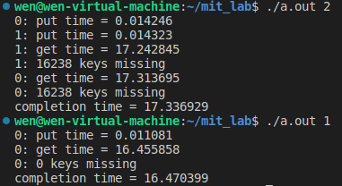
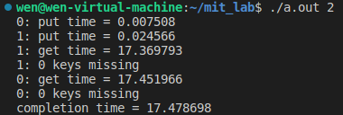

# MIT 6.828 Learning 2

##### [课程表](https://pdos.csail.mit.edu/6.828/2018/schedule.html)

##### [调试指令列表](https://pdos.csail.mit.edu/6.828/2018/labguide.html)

##### [Github参考](https://github.com/setowenGit/MIT6.828_OS)

##### [Gitee参考](https://gitee.com/rcary/mit6.828/tree/master)

##### [Github参考2](https://github.com/clpsz/mit-jos-2014/tree/master)

##### [知乎参考](https://zhuanlan.zhihu.com/p/166413604)

##### [Github参考3](https://github.com/yunwei37/6.828-2018-labs?tab=readme-ov-file)

##### [lecture的翻译笔记](https://zhuzilin.github.io/blog/tags/6-828/)

##### [CSDN参考](https://blog.csdn.net/qq_43012789?type=blog)

##### [博客园参考](https://www.cnblogs.com/fatsheep9146/p/5451579.html)
##### [实验环境配置(其他报错问题可看评论区)](https://blog.csdn.net/Rcary/article/details/125547980?utm_source=app&app_version=4.17.0)

---

## Lecture 8: Interrupts, System calls, and Exceptions

Interrupts VS Polling

一些设备可以在不到1微秒的时间内生成中断，比如GB ethernet，而中断却需要大约微妙时间量级。因为需要保存和恢复状态，同时中断伴随着cache misses。那么我们该如何处理间隔小于1微秒的中断呢？

可以使用Polling：处理器按一定周期检查设备是否有需要，这种方法虽然在设备很慢的时候很浪费，但是设备很快的时候就很好了，因为不需要保存寄存器等等

* 对high-rate device用polling，慢的用interrupt
* 也可以在polling和interrupt之间相互切换，如果rate is low用interrupt，反之用polling

## HW 6：Threads and Locking

[参考这个笔记](https://blog.csdn.net/userXKk/article/details/107979990)

ph.c主要实现了一个有外链的哈希表的多线程插入和取值

编译运行后如下，其中参数1表示开启1个线程，参数2表示开启2个线程



可发现开启2个线程的时候会报 keys missing 的错误

取值部分不会对内存进行修改，所以不用加锁

而在插入的时候，考虑一种情况，当两个线程同时进入这段代码，且put的局部变量 i 相同时，两个线程会先后对 table[i] 进行赋值，那么会导致一个线程要插入的key覆盖了另一个线程的key，所以会有丢失key的状况

```c++
static void 
insert(int key, int value, struct entry **p, struct entry *n)
{
  struct entry *e = malloc(sizeof(struct entry));
  e->key = key;
  e->value = value;
  e->next = n;
  *p = e;
}

static 
void put(int key, int value)
{
  int i = key % NBUCKET;
  insert(key, value, &table[i], table[i]);
}
```

为了避免发生丢失key的情况，在put插入lock和unlock语句，也就是加入互斥锁

```c++
// 互斥锁数组
pthread_mutex_t lock[NBUCKET];

// 在main函数中初始化互斥锁
for(int i=0;i<NBUCKET;i++) {
    pthread_mutex_init(&lock[i],NULL);
}

// 在insert前后加入互斥锁
static 
void put(int key, int value)
{
  int i = key % NBUCKET;
  pthread_mutex_lock(&lock[i]);
  insert(key, value, &table[i], table[i]);
  pthread_mutex_unlock(&lock[i]);
}
```

重新编译运行，发现mssing为0



## Lecture 9: Locking

lock的简单抽象：

```c++
lock l
acquire(l)
  x = x + 1 -- "critical section"
release(l)
```

我们什么时候需要锁:

* 当2个或更多的线程触及到内存时
* 当至少一个线程写入时

那我们能不能自动加锁呢？比如说每个数据都自动的和一个锁相连，这样太死板，会出现问题，比如说 ```rename("d1/x", "d2/y")```，实行的步骤就会是

* lock d1, erase x, unlock d1
* lock d2 add y unlock d2

这样会导致有一段时间文件消失了，那么信息也就没了...我们需要的是：

* lock d1; lock d2
* erase x, add y
* unlock d2; unlock d1

也就是说程序员需要能够控制中间过程

我们可以把锁想想成如下几点：

* avoid lost update
* create atomic multi-step operations -- hide intermediate states
* maintain invariants on a data structure

**deadlock**: 对于上面的那个rename，对于有2个锁的方案，如果同时运行 ```rename(d1/x, d2/y)和rename(d2/a, d1/b)``` 就会发生死锁。解决方案就是让程序员给所有的锁制定一个顺序，并让代码遵循这个顺序。显然这是很复杂的。

**lock vs tradeoff**: 同时这个解决方案会出现一个tradeoff，因为为了避免死锁，我们需要知道函数里面是怎么上锁的。或者说locks are often not the provate business of individual modules。所以一些时候，我们就 粗暴的在函数两端上锁来使其变为单线程运行的

**Locks and parallleism**: 锁实际上是在避免并行操作。而符合分割数据和锁，或者说设计"fine grained locks"是很难的。所以一般从一个单独的大锁开始，如果有需要再分为多个锁

关于用锁的几点建议：

* 如非必要，请勿分享你的锁
* 从粗粒度的锁开始慢慢细化
* 检测你的代码——哪些锁阻碍了并行性
* 仅在并行性能需要时使用细粒度锁
* 使用自动锁冲突检测器

## HW 7: HW xv6 locks

我们将探索中断与锁机制的一些互相作用的情况

弄清楚如果xv6内核执行下列这段代码,为什么会发生panic的情况？

```c++
struct spinlock lk;
initlock(&lk, "test lock");
acquire(&lk);
acquire(&lk);
```

查看 spinlock.c

```c++
// 上锁（自旋锁）
void
acquire(struct spinlock *lk)
{
  pushcli(); // 失能中断以避免死锁
  if(holding(lk))
    panic("acquire");
  // xchg — 交换操作，它原子性地交换两个操作数的值
  while(xchg(&lk->locked, 1) != 0) 
    ;
  // 避免编译器在优化的时候更改指令顺序，使得锁失效
  __sync_synchronize();
  // Record info about lock acquisition for debugging.
  lk->cpu = mycpu();
  getcallerpcs(&lk, lk->pcs);
}

// 检查该cpu是否已经拥有这个锁，若已经拥有，则不能再次上锁
int
holding(struct spinlock *lock)
{
  int r;
  pushcli();
  r = lock->locked && lock->cpu == mycpu();
  popcli();
  return r;
}
```

所以，根据代码逻辑可以知道，当前cpu已经获取了锁的情况下，再次请求上锁会导致panic


