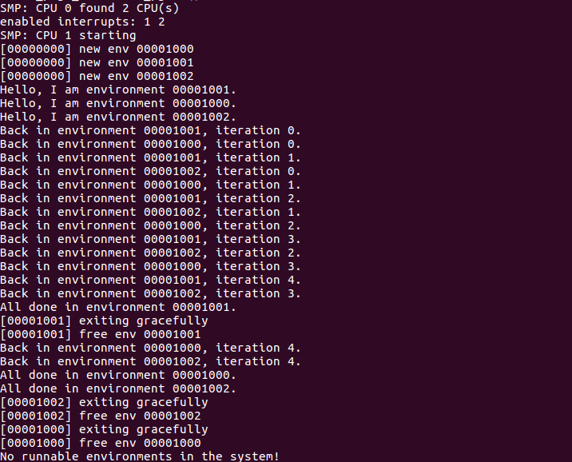
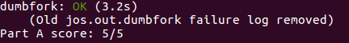

# MIT 6.828 Learning 2

##### [课程表](https://pdos.csail.mit.edu/6.828/2018/schedule.html)

##### [调试指令列表](https://pdos.csail.mit.edu/6.828/2018/labguide.html)

##### [Github参考](https://github.com/setowenGit/MIT6.828_OS)

##### [Gitee参考](https://gitee.com/rcary/mit6.828/tree/master)

##### [Github参考2](https://github.com/clpsz/mit-jos-2014/tree/master)

##### [知乎参考](https://zhuanlan.zhihu.com/p/166413604)

##### [Github参考3](https://github.com/yunwei37/6.828-2018-labs?tab=readme-ov-file)

##### [lecture的翻译笔记](https://zhuzilin.github.io/blog/tags/6-828/)

##### [CSDN参考](https://blog.csdn.net/qq_43012789?type=blog)

##### [博客园参考](https://www.cnblogs.com/fatsheep9146/p/5451579.html)
##### [实验环境配置(其他报错问题可看评论区)](https://blog.csdn.net/Rcary/article/details/125547980?utm_source=app&app_version=4.17.0)

---

## Lecture 8: Interrupts, System calls, and Exceptions

Interrupts VS Polling

一些设备可以在不到1微秒的时间内生成中断，比如GB ethernet，而中断却需要大约微妙时间量级。因为需要保存和恢复状态，同时中断伴随着cache misses。那么我们该如何处理间隔小于1微秒的中断呢？

可以使用Polling：处理器按一定周期检查设备是否有需要，这种方法虽然在设备很慢的时候很浪费，但是设备很快的时候就很好了，因为不需要保存寄存器等等

* 对high-rate device用polling，慢的用interrupt
* 也可以在polling和interrupt之间相互切换，如果rate is low用interrupt，反之用polling

## HW 6：Threads and Locking

[参考这个笔记](https://blog.csdn.net/userXKk/article/details/107979990)

ph.c主要实现了一个有外链的哈希表的多线程插入和取值

编译运行后如下，其中参数1表示开启1个线程，参数2表示开启2个线程


可发现开启2个线程的时候会报 keys missing 的错误

取值部分不会对内存进行修改，所以不用加锁

而在插入的时候，考虑一种情况，当两个线程同时进入这段代码，且put的局部变量 i 相同时，两个线程会先后对 table[i] 进行赋值，那么会导致一个线程要插入的key覆盖了另一个线程的key，所以会有丢失key的状况

```c++
static void 
insert(int key, int value, struct entry **p, struct entry *n)
{
  struct entry *e = malloc(sizeof(struct entry));
  e->key = key;
  e->value = value;
  e->next = n;
  *p = e;
}

static 
void put(int key, int value)
{
  int i = key % NBUCKET;
  insert(key, value, &table[i], table[i]);
}
```

为了避免发生丢失key的情况，在put插入lock和unlock语句，也就是加入互斥锁

```c++
// 互斥锁数组
pthread_mutex_t lock[NBUCKET];

// 在main函数中初始化互斥锁
for(int i=0;i<NBUCKET;i++) {
    pthread_mutex_init(&lock[i],NULL);
}

// 在insert前后加入互斥锁
static 
void put(int key, int value)
{
  int i = key % NBUCKET;
  pthread_mutex_lock(&lock[i]);
  insert(key, value, &table[i], table[i]);
  pthread_mutex_unlock(&lock[i]);
}
```

重新编译运行，发现mssing为0


## Lecture 9: Locking

lock的简单抽象：

```c++
lock l
acquire(l)
  x = x + 1 -- "critical section"
release(l)
```

我们什么时候需要锁:

* 当2个或更多的线程触及到内存时
* 当至少一个线程写入时

那我们能不能自动加锁呢？比如说每个数据都自动的和一个锁相连，这样太死板，会出现问题，比如说 ```rename("d1/x", "d2/y")```，实行的步骤就会是

* lock d1, erase x, unlock d1
* lock d2 add y unlock d2

这样会导致有一段时间文件消失了，那么信息也就没了...我们需要的是：

* lock d1; lock d2
* erase x, add y
* unlock d2; unlock d1

也就是说程序员需要能够控制中间过程

我们可以把锁想想成如下几点：

* avoid lost update
* create atomic multi-step operations -- hide intermediate states
* maintain invariants on a data structure

**deadlock**: 对于上面的那个rename，对于有2个锁的方案，如果同时运行 ```rename(d1/x, d2/y)和rename(d2/a, d1/b)``` 就会发生死锁。解决方案就是让程序员给所有的锁制定一个顺序，并让代码遵循这个顺序。显然这是很复杂的。

**lock vs tradeoff**: 同时这个解决方案会出现一个tradeoff，因为为了避免死锁，我们需要知道函数里面是怎么上锁的。或者说locks are often not the provate business of individual modules。所以一些时候，我们就 粗暴的在函数两端上锁来使其变为单线程运行的

**Locks and parallleism**: 锁实际上是在避免并行操作。而符合分割数据和锁，或者说设计"fine grained locks"是很难的。所以一般从一个单独的大锁开始，如果有需要再分为多个锁

关于用锁的几点建议：

* 如非必要，请勿分享你的锁
* 从粗粒度的锁开始慢慢细化
* 检测你的代码——哪些锁阻碍了并行性
* 仅在并行性能需要时使用细粒度锁
* 使用自动锁冲突检测器

## HW 7: HW xv6 locks

我们将探索中断与锁机制的一些互相作用的情况

弄清楚如果xv6内核执行下列这段代码,为什么会发生panic的情况？

```c++
struct spinlock lk;
initlock(&lk, "test lock");
acquire(&lk);
acquire(&lk);
```

查看 spinlock.c

```c++
// 上锁（自旋锁）
void
acquire(struct spinlock *lk)
{
  pushcli(); // 失能中断以避免死锁
  if(holding(lk))
    panic("acquire");
  // xchg — 交换操作，它原子性地交换两个操作数的值
  while(xchg(&lk->locked, 1) != 0) 
    ;
  // 避免编译器在优化的时候更改指令顺序，使得锁失效
  __sync_synchronize();
  // Record info about lock acquisition for debugging.
  lk->cpu = mycpu();
  getcallerpcs(&lk, lk->pcs);
}

// 检查该cpu是否已经拥有这个锁，若已经拥有，则不能再次上锁
int
holding(struct spinlock *lock)
{
  int r;
  pushcli();
  r = lock->locked && lock->cpu == mycpu();
  popcli();
  return r;
}
```

所以，根据代码逻辑可以知道，当前cpu已经获取了锁的情况下，再次请求上锁会导致panic

## Lab 4: Preemptive Multitasking

在实验4中，新增了如下新的代码

* kern/cpu.h 多处理器支持的内核私有定义
* kern/mpconfig.c 读取多处理器配置的代码
* kern/lapic.c 驱动每个处理器中的本地 APIC 单元的内核代码
* kern/mpentry.S 非引导 CPU 的汇编语言入口代码
* kern/spinlock.h 自旋锁的内核私有定义，包括大内核锁
* kern/spinlock.c 实现自旋锁的内核代码
* kern/sched.c 您将要实现的调度程序的代码框架

### Part A: Multiprocessor Support and Cooperative Multitasking

#### Multiprocessor Support

我们将使JOS支持“对称多处理”(symmetric multiprocessing, SMP)——一种多处理模型。在这种模型中，所有的处理器都可以同等地使用系统资源，如内存和输入/输出总线。虽然所有的处理器在功能上都是相同的，但在引导过程中，他们可以分为两种类型：

* bootstrap processor (BSP): 负责初始化系统和引导操作系统
* application processors (APs): 只有在操作系统启动并运行之后，应用处理器才被BSP激活

哪个处理器是BSP由硬件和BIOS决定。到目前为止，所有JOS代码都在BSP上运行

在SMP系统中，每个CPU都有一个配套的local APIC(LAPIC)单元。LAPIC单元负责在整个系统中传递中断。LAPIC还为其连接的CPU提供一个唯一的标识符。在本实验中，我们利用了LAPIC单元的以下基本功能(在kern/lapic.c中)

1. 读取LAPIC标识(APIC ID)来判断我们的代码当前运行在哪个处理器上
2. 把STARUP处理器间中断(IPI)从BSP发送到APs以启动其他处理器(参见lapic_startap())
3. 在Part C中，我们对LAPIC的内置定时器进行编程，以触发时钟中断来支持抢占式多任务处理

处理器使用内存映射I/O(MMIO)来访问其LAPIC。在MMIO中，物理存储器的一部分被硬连线到一些IO设备的寄存器，因此通常用于访问存储器的相同的load/store指令可以用于访问设备寄存器。在物理地址0xA0000处可以看到一个IO hole(我们用它来写入VGA显示缓冲区)

LAPIC的 hole 开始于物理地址0xFE000000(4GB位置仅差32MB)，但是这地址太高我们无法访问通过过去的直接映射(虚拟地址0xF0000000映射0x0，即只有256MB)。但是JOS虚拟地址映射预留了4MB空间在MMIOBASE处，我们需要分配映射空间

###### exercise 1

在kern/pmap.c文件中实现mmio_map_region. 要了解如何使用它，需要查看kern/lapic.c中lapic_init的开头。在运行mmio_map_region测试之前，必须做完下一个练习

如下所示

```c++
volatile uint32_t *lapic;
lapic = mmio_map_region(lapicaddr, 4096);

// 在MMIO区域保留大小字节，并在此位置映射[pa,pa+size]。
// 返回保留区域的基数。size参数不一定是PGSIZE的倍数。
void *
mmio_map_region(physaddr_t pa, size_t size)
{
	static uintptr_t base = MMIOBASE;
	// 预留虚拟内存的大小字节,从基数开始,将物理页[pa,pa+size]映射到虚拟地址[base,base+size].
    // 由于这是设备内存,而不是普通的DRAM,你必须告诉CPU,对这个内存进行缓存访问是不安全的.
    // 幸运的是,pagetables提供了用于此目的的二进制位；只需在PTE_W之外再加上PTE_PCD|PTE_PWT（禁用缓存和write-through）来创建映射
	void *ret = (void *)base;
	size = ROUNDUP(size, PGSIZE);
	if (base + size > MMIOLIM || base + size < base) {
		panic("mmio_map_region reservation overflow\n");
	}
	boot_map_region(kern_pgdir, base, size, pa, PTE_W|PTE_PCD|PTE_PWT);
	base += size; // 注意base是静态的，需要时时更新
	return ret;
}
```

##### Application Processor Bootstrap

AP启动流程：

1. 在启动APs之前，BSP首先应该收集关于多处理器系统的信息，例如CPU的总数，它们的APIC ID，和LAPIC单元的MMIO地址。kern/mpconfig.c中的mp_init()函数通过读取驻留在BIOS内存区域中的MP配置表来检索该信息
2. boot_aps函数(在kern/init.c中)驱动AP引导进程。APs在实模式下启动，就像引导程序在boot/boot.S下启动一样。所以boot_aps会复制AP入口代码地址(kern/mpentry.S)到在实模式下可寻址的存储器位置
3. 与引导加载程序不同，我们可以控制应用程序从哪里开始执行代码，我们将入口代码复制到0x7000(MPETRY_PADDR)，但是任何未使用的、页面对齐的低于640KB的物理地址都可以工作
4. 在这之后，boot_aps()通过向相应AP的LAPIC单元发送STARTUP IPI和一个初始CS:IP地址，AP应该在该地址开始运行其入口代码(MPENTRY_PADDR)，一个接一个地激活APs。在kern/mpentry.S中的入口代码跟boot/boot.S中的代码类似
5. 在一些简单的配置后，它使AP进入开启分页机制的保护模式，然后调用C语言的setup函数mp_main. boot_aps等待AP在其结构CpuInfo的cpu_status字段中发出CPU_STARTED标志信号，然后再唤醒下一个

###### exercise 2

修改kern/pmap.c中实现的page_init()，以避免将MPENTRY_PADDR页面添加到空闲列表中，这样我们就可以安全复制并运行该物理地址上的AP引导代码，代码通过check_page_free_list测试

**首先需要理解boot_aps()函数**

```c++
// 存储有AP的入口函数地址的物理地址
#define MPENTRY_PADDR	0x7000
// cpu的内核栈，在这里使用数组实现
unsigned char percpu_kstacks[NCPU][KSTKSIZE]

// 启动APs
static void
boot_aps(void)
{
	extern unsigned char mpentry_start[], mpentry_end[];
	void *code;
	struct CpuInfo *c;
	// 将入口函数地址复制到物理地址 MPENTRY_PADDR 所对应的虚拟地址上
	code = KADDR(MPENTRY_PADDR);
	memmove(code, mpentry_start, mpentry_end - mpentry_start);
	// 在循环里每次启动一个AP
	for (c = cpus; c < cpus + ncpu; c++) {
		// 如果cpu结构体c与现在正在运行的cpu结构体相同，说明该AP已经启动了
		if (c == cpus + cpunum())
			continue;
		// mpentry_kstack存有分配给该AP的栈的栈顶地址
		mpentry_kstack = percpu_kstacks[c - cpus] + KSTKSIZE;
		// 从MPENTRY_PADDR中存储的AP的入口函数地址开始，启动AP
		lapic_startap(c->cpu_id, PADDR(code));
		// 等待AP发出的CPU_STARTED信号
		while(c->cpu_status != CPU_STARTED)
			;
	}
}
```

* 上面的lapic_startap()函数相当于往一个全局内存lapic中写入数据，从而完成BSP与AP的通讯
* lapic是在lapic_init()函数中通过exercise 1中修改的mmio_map_region()函数实现赋值的,具体来说是代码```lapic = mmio_map_region(lapicaddr, 4096);```
* lapicaddr是LAPIC的IO hole的地址，在mmio_map_region()中就是将这个地址映射到MMIOBASE上，从而BSP可以访问到MMIOBASE上的数据，从而实现与LAPIC以内存映射IO方式的通讯交流

**接着要理解mpentry.S汇编文件**

* 这段代码其实就是AP的入口函数，是上面boot_aps函数中的以```mpentry_start```为起止地址的代码，上述函数就是将这段代码复制到MPENTRY_PADDR起始的位置上
* 这个汇编文件主要做的事情是跳转到c语言函数mp_main()中

**接着要理解mp_main()函数**

* 主要完成lapic的初始化，加载GDT以及段描述符，初始化并加载所有CPU的TSS、和 IDT
* 最后将cpu状态设置为CPU_STARTED，那么boot_aps函数将退出while

**修改page_init**

* 增加一个判断条件，将MPENTRY_PADDR这一页设置为已使用

```c++
uint32_t mpentry_pn = ((uint32_t) KADDR(MPENTRY_PADDR) - KERNBASE) / PGSIZE;

else if(i == mpentry_pn) {
			pages[i].pp_ref = 1;
		}
```

**Question:** 将kern/mpentry.S与boot/boot.S并排比较，kern/mpentry.S就像内核中的其他内容一样在KERNBASE地址之上被编译链接运行，宏定义MPBOOTPHYS的目的是什么？什么不是在boot/boot.S但是是在kern/mpentry.S必要的？换句话说，如果在kern/mpentry中省略了它，会出现什么问题？

在mpentry.S的注释里面有写这两者的区别：与boot/boot.S类似,只是

* 它不需要启用A20
* 它使用MPBOOTPHYS来计算其符号的绝对地址,而不是依靠链接器来填充它们

这种转换是因为bootloader的LMA和VMA都在0x7c00，所以运行boot.S时虚拟地址就是物理地址，不需要转换。但是kernel中的则不然，主CPU已经处于保护模式下了，因此是不能直接指定物理地址，需要进行虚拟地址到物理地址的转换。

而在加载GDT的时候需要物理地址，所以宏定义MPBOOTPHYS的作用就是将虚拟地址s转换为物理地址：

```c++
#define MPBOOTPHYS(s) ((s) - mpentry_start + MPENTRY_PADDR)
```

mpentry_start就是AP入口函数的虚拟地址，而MPENTRY_PADDR是对应的物理地址。相当于是把gdt的位置相对于mpentry_start的地址对应到MPENTRY_PADDR + gdt - mpentry_start，就如同boot.S中gdt对应到在start + gdt - start

##### Per-CPU State and Initialization

在编写多处理操作系统时，区分每个处理器专用的per-CPU状态和整个系统共享的全局状态非常重要。kern/cpu.h定义了大部分的per-CPU状态，包括存储per-CPU变量的结构CpuInfo. cpunum()总是返回调用它的CPU的ID，可以用作像CPU这样的数组的索引。另外，宏thiscpu是当前cpu结构CpuInfo的简写

```c++
// cpu信息结构体
struct CpuInfo {
	uint8_t cpu_id;                 // cpu的id，对应cpus数组的索引
	volatile unsigned cpu_status;   // cpu的状态
	struct Env *cpu_env;            // cpu中正在运行的进程（环境）
	struct Taskstate cpu_ts;        // 内核栈状态TSS
};
```

* Per-CPU kernel stack: 因为多个CPU可以同时陷入到内核，所以每个处理器需要一个单独的内核堆栈，以防止它们相互干扰执行
  * 数组percpu_kstack[NCPU][KSTKSIZE]为NCPU的内核堆栈保留空间
  * 在Lab2中，映射了bootstack，是BSP内核堆栈的物理内存，该内核堆栈位于KSTACKTOP之下
  * 相似的，在这个lab中，会映射每个CPU的内核堆栈到这个区域，并使用保护页面(guard pages)作为它们之间的缓冲区(buffer)，避免某个CPU内存溢出了干扰到其他CPU的栈
  * CPU 0的堆栈仍然会从KSTACKTOP向下增长；CPU 1的堆栈将在CPU 0的堆栈底部以下启动KSTKGAP字节，以此类推，inc/memlayout.h显示了映射布局
* Per-CPU TSS and TSS descriptor: per-CPU的任务状态段(task state segment, TSS), 指定每个CPU的内核栈位于何处。CPU i的TSS存在于cpus[i].cpu_ts中，相应的TSS描述符定义在GDT条目的gdt[(GD_TSS0 >> 3) + i]中。定义在kern/trap.c中的全局ts变量不再有用
* Per-CPU current environment pointer: 因为每个CPU可以同时运行不同用户程序，我们可以重新定义符号curenv成cpus[cpunum()].cpu_env( or thiscpu->cpu_env)，它将指向当前CPU上正在执行的environment
* Per-CPU system registers: 所有寄存器，包括系统寄存器都是CPU私有的。因此，初始化这些寄存器的指令，例如lcr3(), ltr()，lgbt(), lidt()等等，都必须在每个CPU上执行一次。函数env_init_percpu()和trap_init_percpu()就是为这个定义的

###### exercise 3

修改在kern/pmap.c中的mem_init_mp()去映射从KSTACKTOP开始的per-CPU栈，如inc/memlayout.h所示。每个stack的大小都是KSTKSIZE字节加未映射保护页(guard pages)的KSTKGAP字节。代码应该通过check_kern_pgdir()的检测

主要是遍历每个CPU，当遍历到CPU i时，将数组percpu_kstacks[i]所对应的内存映射到kstacktop_i - KSTKSIZE上

```c++
static void
mem_init_mp(void)
{
	size_t i;
	size_t kstacktop_i;
	for(i = 0; i < NCPU; i++) {
		kstacktop_i = KSTACKTOP - i * (KSTKSIZE + KSTKGAP);
		boot_map_region(kern_pgdir, kstacktop_i - KSTKSIZE, KSTKSIZE,
						PADDR(&percpu_kstacks[i]), PTE_W );
	}
}

```

###### exercise 4

在kern/trap.c中的trap_init_percpu()中的代码初始化BSP的TSS和TSS描述符。它在实验3中有效。但是在其他处理器上运行时不正确，更改代码，以便他可以在所有CPU上工作（注意：新代码不应该使用ts全局变量了）

在这里并不是要对所有的CPU进行init，实际上此时代码执行发生在不同的CPU上，只需要对自身CPU进行初始化即可。即使用 ```thiscpu->cpu_ts``` 代替之前的全局变量 ```ts```

```c++
void
trap_init_percpu(void)
{
	// Setup a TSS so that we get the right stack
	// when we trap to the kernel.
	// ts.ts_esp0 = KSTACKTOP;
	// ts.ts_ss0 = GD_KD;
	// ts.ts_iomb = sizeof(struct Taskstate);
	thiscpu->cpu_ts.ts_esp0 = KSTACKTOP - cpunum() * (KSTKGAP + KSTKSIZE);
    thiscpu->cpu_ts.ts_ss0 = GD_KD;
	thiscpu->cpu_ts.ts_iomb = sizeof(struct Taskstate);
	// Initialize the TSS slot of the gdt.
	// gdt[GD_TSS0 >> 3] = SEG16(STS_T32A, (uint32_t) (&ts), sizeof(struct Taskstate) - 1, 0);
	// gdt[GD_TSS0 >> 3].sd_s = 0;
	gdt[(GD_TSS0 >> 3) + cpunum()] = SEG16(STS_T32A, (uint32_t) (&thiscpu->cpu_ts), sizeof(struct Taskstate) - 1, 0);
    gdt[(GD_TSS0 >> 3) + cpunum()].sd_s = 0;
	// Load the TSS selector (like other segment selectors, the
	// bottom three bits are special; we leave them 0)
	// ltr(GD_TSS0);
	ltr(GD_TSS0 + sizeof(struct Segdesc) * cpunum());
	// Load the IDT
	lidt(&idt_pd);
}
```

注意，我们需要运行命令```make qemu-nox CPUS=4```才会有四个核，打印信息才会是```SMP: CPU 0 found 4 CPU(s)```，否则默认是只有一个核

##### Locking

我们当前的代码在mp_main()中初始化AP之后自旋(spin), 在让AP更进一步之前，我们需要首先解决多个处理器同时运行内核代码时竞争条件

实现这一点最简单的方法是使用一个大的内核锁。大内核锁是一个单一的全局锁，当环境进入内核模式时被持有，当环境返回用户模式时被释放。在这个模型中，用户模式下的环境可以在任何可用的处理器上并发运行。但是不能有超过一个环境在内核模式下运行，试图进入内核模式的任何其他环境都被迫等待

kern/spinlock.h中声明了大内核锁kernel_lock.  它也提供了lock_kernel()和unlock_kernel()函数，简单地去获取或释放这个锁。需要在以下四个位置应用大内核锁：

* i386_init()中，在BSP唤醒其他CPUs前获取大内核锁
* mp_main()中，在初始化AP后获取锁，然后调用sched_yield()去在该AP上启动运行环境
* trap()中，当从用户模式陷入内核模式时获取锁，可以检查tf_cs的低位确定是trap是发生在用户模式还是内核模式
* env_run()中，在切换到用户模式前释放锁，不要太早或太晚释放，否则会经历races或者deadlocks\

###### exercise 5

通过在合适的位置上调用lock_kernel()和unlock_kernel, 像上面描述的那样应用大内核锁

* lock_kernel()函数实际上是调用spin_lock()函数，里面实现上锁的代码是```xchg(&lk->locked, 1);```，xchg是汇编交换两个操作数内容的指令，该指令保证原子性
* unlock_kernel()函数实际上是调用spin_unlock()函数，里面实际解锁的代码是```xchg(&lk->locked, 0);```
* sched_yield()函数是线程（环境）调度函数

**修改i386_init()**

```c++
// Acquire the big kernel lock before waking up APs
// Your code here:
lock_kernel();
// Starting non-boot CPUs
boot_aps();
```

**修改mp_main()**

```c++
// Your code here:
lock_kernel();
sched_yield();
// Remove this after you finish Exercise 6
for (;;);
```

**修改trap()**

```c++
if ((tf->tf_cs & 3) == 3) {
  // Trapped from user mode.
  // Acquire the big kernel lock before doing any
  // serious kernel work.
  // LAB 4: Your code here.
  lock_kernel();
  assert(curenv);
```

**修改env_run()**

```c++
lcr3(PADDR(curenv->env_pgdir));
unlock_kernel();
cprintf("start env_pop and running...\n");
```

**Question:** 似乎我们只需要使用大内核锁就能保证每次只有一个CPU运行内核代码，为什么还需要给每个CPU单独的内核堆栈？描述一下即便有大内核锁的保护但使用共享内核堆栈仍然出错的场景

因为每个CPU进入内核时都会对一些数据进行压栈，这些数据可能是该CPU下某环境的数据，也可能是下一次再进入内核时需要的数据，若共用内核栈，每个CPU保存的上下文信息就会被破坏

> 在Linux系统中，多个CPU可以同时进入内核态。Linux操作系统支持对称多处理（SMP），这意味着多个CPU核心可以同时执行内核代码，处理系统的各种任务和中断。每个CPU核心都可以独立地处理内核态的操作，不会因为其他CPU核心在内核态而被阻塞。
> 
> 在多CPU系统中，Linux确保对共享的内核数据进行正确的同步和互斥操作，以避免数据不一致的情况发生。这通常通过使用锁和其他同步机制来实现，确保只有一个CPU可以修改特定的内核数据，而其他CPU在修改之前必须等待或检查状态。因此，即使多个CPU可以同时进入内核态，Linux内核会确保在多处理器环境下维护数据的一致性和完整性。
>
> MIT 6.828课程中讨论的情况不适用于所有操作系统，特别是Linux操作系统在设计上允许多CPU同时进入内核态，该课程的操作系统这样设计的目的大概是这样实现简单，而且也避开了如何共享内核数据这个问题

#### Round-Robin Scheduling

下一个任务是修改JOS内核使它能以轮转(round-robin)的方式在多个环境中切换

轮转调度程(Round-robin scheduing)在JOS中是这样工作的：

* kern/sched.c中的sched_yield()函数负责选择一个新的环境去运行，它以循环的方式在env[]数组中顺序搜索，从在运行的环境开始（或者当之前没有运行环境时，就从这个数组的开头开始），选择它找到的第一个状态是ENV_RUNNABLE的环境，然后调用env_run()跳转到那个环境
* sched_yield()一定不能在同一个时间在两个CPU上运行同一个环境。它会说一个环境正在运行在某个CPU上（可能是当前CPU），因为那个环境状态是ENV_RUNNING
* 这里已经完成了一个系统调用，sys_yield()，用户环境会调用它去调用内核的sched_yield()函数，并且自愿放弃CPU给另一个环境

###### exercise 6

在sched_yield()中实现循环轮转调度程序。不要忘记修改syscall()从而转到sys_yield()。确保在mp_main()中调用sched_yield()。修改kern/init.c去创造三个（甚至更多）全部运行程序user/yield.c的环境。

**编写sched_yield函数**

```c++
void
sched_yield(void)
{
	struct Env *idle;
	// 实现简单的轮流调度。
    // 在'envs'中搜索一个 ENV_RUNNABLE 环境，
    // 以循环的方式从这个 CPU 最后运行的环境开始。 切换到第一个发现的环境。
    //
    // 如果没有可运行的环境，但是之前在这个CPU上运行的环境仍然是ENV_RUNNING的，
    // 那么就可以选择那个环境。
    //
    // 不要选择目前正在另一个CPU上运行的环境（env_status == ENV_RUNNING）。如果没有可运行的环境，只需跳过下面的代码来停止cpu的运行。
	// LAB 4: Your code here.
	idle = &envs[0]; // 第一个环境
    if (curenv)
        idle = curenv + 1; // 如果现在有在运行的环境，从现在这个的下一个开始遍历
    for (int i = 0; i < NENV - 1; i++)
    {
        if (idle->env_status == ENV_RUNNABLE) // 检查是否可以运行
            env_run(idle);
        // 不能运行就++，要求环状循环
        if (idle == &envs[NENV - 1]) // 最后一个环境
            idle = &envs[0];         // 回到第一个环境
        else
            idle++;
    }
    if (idle == curenv && curenv->env_status == ENV_RUNNING) // 转一圈又回到自己
        env_run(curenv);
	// sched_halt never returns
	sched_halt();
}
```

**修改syscall函数**

```c++
case SYS_yield: 
		sys_yield();
		return 0;
```

**BSP创建三个环境以验证**

```c++
// Touch all you want.
// ENV_CREATE(user_primes, ENV_TYPE_USER);
ENV_CREATE(user_yield, ENV_TYPE_USER);
ENV_CREATE(user_yield, ENV_TYPE_USER);
ENV_CREATE(user_yield, ENV_TYPE_USER);
```

在这个用户环境yield函数中，每隔一段时间会调用一次sys_yield来切换环境

```c++
void
umain(int argc, char **argv)
{
	int i;

	cprintf("Hello, I am environment %08x.\n", thisenv->env_id);
	for (i = 0; i < 5; i++) {
		sys_yield();
		cprintf("Back in environment %08x, iteration %d.\n",
			thisenv->env_id, i);
	}
	cprintf("All done in environment %08x.\n", thisenv->env_id);
}
```

最后输入```make qemu CPUS=2```，输出结果如下，可看到每个环境在切换五次后就完成



值得注意的是，实际上完成上述的操作还未能运行成功，会出现page fault的trap，经过排查，需要提前将exercise 13的外部中断实现，能够正常运行

```c++
// trap.c: trap_init()
SETGATE(idt[IRQ_OFFSET + 0],  0, GD_KT, irq_0_handler,  0);
SETGATE(idt[IRQ_OFFSET + 1],  0, GD_KT, irq_1_handler,  0);
SETGATE(idt[IRQ_OFFSET + 2],  0, GD_KT, irq_2_handler,  0);
SETGATE(idt[IRQ_OFFSET + 3],  0, GD_KT, irq_3_handler,  0);
SETGATE(idt[IRQ_OFFSET + 4],  0, GD_KT, irq_4_handler,  0);
SETGATE(idt[IRQ_OFFSET + 5],  0, GD_KT, irq_5_handler,  0);
SETGATE(idt[IRQ_OFFSET + 6],  0, GD_KT, irq_6_handler,  0);
SETGATE(idt[IRQ_OFFSET + 7],  0, GD_KT, irq_7_handler,  0);
SETGATE(idt[IRQ_OFFSET + 8],  0, GD_KT, irq_8_handler,  0);
SETGATE(idt[IRQ_OFFSET + 9],  0, GD_KT, irq_9_handler,  0);
SETGATE(idt[IRQ_OFFSET + 10], 0, GD_KT, irq_10_handler, 0);
SETGATE(idt[IRQ_OFFSET + 11], 0, GD_KT, irq_11_handler, 0);
SETGATE(idt[IRQ_OFFSET + 12], 0, GD_KT, irq_12_handler, 0);
SETGATE(idt[IRQ_OFFSET + 13], 0, GD_KT, irq_13_handler, 0);
SETGATE(idt[IRQ_OFFSET + 14], 0, GD_KT, irq_14_handler, 0);
SETGATE(idt[IRQ_OFFSET + 15], 0, GD_KT, irq_15_handler, 0);

// trap.c: trap_dispatch()
case (IRQ_OFFSET + IRQ_TIMER):
      lapic_eoi();
      sched_yield();
      break;

// trapentry.S
TRAPHANDLER_NOEC(irq_0_handler,  IRQ_OFFSET + 0);
TRAPHANDLER_NOEC(irq_1_handler,  IRQ_OFFSET + 1);
TRAPHANDLER_NOEC(irq_2_handler,  IRQ_OFFSET + 2);
TRAPHANDLER_NOEC(irq_3_handler,  IRQ_OFFSET + 3);
TRAPHANDLER_NOEC(irq_4_handler,  IRQ_OFFSET + 4);
TRAPHANDLER_NOEC(irq_5_handler,  IRQ_OFFSET + 5);
TRAPHANDLER_NOEC(irq_6_handler,  IRQ_OFFSET + 6);
TRAPHANDLER_NOEC(irq_7_handler,  IRQ_OFFSET + 7);
TRAPHANDLER_NOEC(irq_8_handler,  IRQ_OFFSET + 8);
TRAPHANDLER_NOEC(irq_9_handler,  IRQ_OFFSET + 9);
TRAPHANDLER_NOEC(irq_10_handler, IRQ_OFFSET + 10);
TRAPHANDLER_NOEC(irq_11_handler, IRQ_OFFSET + 11);
TRAPHANDLER_NOEC(irq_12_handler, IRQ_OFFSET + 12);
TRAPHANDLER_NOEC(irq_13_handler, IRQ_OFFSET + 13);
TRAPHANDLER_NOEC(irq_14_handler, IRQ_OFFSET + 14);
TRAPHANDLER_NOEC(irq_15_handler, IRQ_OFFSET + 15);
```

#### System Calls for Environment Creation

尽管内核现在能够在多个用户级环境间运行和切换，但它仍局限于运行内核最初创建设置好的环境。你将实现必要的JOS系统调用允许用户环境创造和启动其他新用户环境。

Unix提供fork()系统调用作为其进程创建原语(primitive)
* Unix的fork()复制父进程的整个地址空间以创造一个新进程(the child)
* 从用户空间可以观察到的这两个程序唯一的区别是它们的进程IDS和它们的父进程IDS不相同（由getpid()和getppid()返回）在父进程中，fork()返回子进程的进程ID，在子进程中，fork()返回0
* 默认地每个进程有它自己的私有地址空间，并且进程对内存的修改是其他进程不可见的

你将提供一组不同的，更加原始的JOS系统调用，用于创建新的用户模式环境。使用这些系统调用，除了创建其他样式的环境之外，将能完全在用户空间实现类Unix的fork()。

**sys_exofork**

这个系统调用创建一个几乎是空白的新环境：没有任何东西映射在它地址空间的用户部分，它也是不可运行的
* 在调用sys_exofork时，新环境与父环境具有相同的寄存器状态
* 在父环境中，sys_exofork会返回新创建环境的envid_t(如果环境分配失败，则返回一个负的错误代码)
* 在子环境中，它会返回0.(因为子环境开始被标记为不可运行，所以sys_exofork实际上不会在子环境中返回，直到父环境通过标记子环境可运行来明确允许)

**sys_env_set_status**

设置指定环境的status为ENV_RUNNABLE或ENV_NOT_RUNNABLE. 当在这个环境地址空间和寄存器状态被完全初始化，这个系统调用用于标记一个新环境表示准备好运行了

**sys_page_alloc**

分配一个物理页并且映射到一个给定环境地址空间的给定虚拟地址上

**sys_page_map**

将一个物理页的映射（并不是物理页的内容）从一个环境的地址空间中复制到另一个环境，保留内存共享安排，使得新旧映射都引用物理内存的同一页

**sys_page_unmap**

取消映射到一个给定环境的给定虚拟地址上的物理页上

对于所有上面接受环境IDs系统调用，JOS内核支持这样的约定：0表示当前环境。本公约在kern/env.c中的envid2env()执行

我们已经在测试程序user/dumbfork.c中提供了一个非常原始的类Unix fork()的实现。这个测试程序使用上述系统调用去创建和运行一个复制了它地址空间的子环境。然后像在之前的练习中一样，这两个环境会使用sys_yield来回切换。父环境在10次迭代后退出，子环境则在20次的迭代后退出

###### exercise 7

在kern/syscall.c中实现上述描述的系统调用，并且确保syscall()调用它们。你将需要使用kern/pmap.c和kern/env.c中的不同函数，尤其是envid2env()。目前为止，每当你调用envid2env()，都要在checkperm参数中传一个1.确保检查了所有无效系统调用参数，在这种情况下返回-E_INVAL。用user/dumbfork测试你的JOS内核，在继续前确保它正常工作

**sys_exofork**

```c++
static envid_t
sys_exofork(void)
{
	struct Env *newenv;
	int32_t ret;
	if ((ret = env_alloc(&newenv, sys_getenvid())) < 0) {
		return ret;
	}
	newenv->env_status = ENV_NOT_RUNNABLE;
	newenv->env_tf = curenv->env_tf;
	// newenv的返回值为0, 实现子进程返回0值
	newenv->env_tf.tf_regs.reg_eax = 0;
	// 返回值存放在eax中
	return newenv->env_id;
}
```

**sys_env_set_status**

```c++
static int
sys_env_set_status(envid_t envid, int status)
{
	struct Env *e;
	// 由环境id获得对应的环境结构体
	// 第三个参数设为1表示需要检查当前环境有没有权限设置envid对应环境的状态
	// 只有envid对应的环境是当前环境或当前环境的直接子环境，才有权限设置状态
	if (envid2env(envid, &e, 1)) return -E_BAD_ENV;

	if (status != ENV_NOT_RUNNABLE && status != ENV_RUNNABLE) 
		return -E_INVAL;

	e->env_status = status;
	return 0;
	panic("sys_env_set_status not implemented");
}
```

**sys_page_alloc**

主要是对 page_alloc() 和 page_insert() 的封装

```c++
static int
sys_page_alloc(envid_t envid, void *va, int perm)
{
	int ret = 0;
	struct Env *env;
	if ((ret = envid2env(envid, &env, 1)) < 0) 
		return -E_BAD_ENV;
	if((uintptr_t)va >= UTOP || PGOFF(va))
		return -E_INVAL;
	if ((perm & PTE_U) == 0 || (perm & PTE_P) == 0)
        return -E_INVAL;
	if (perm & ~PTE_SYSCALL)
		return -E_INVAL;
	struct PageInfo *pp = page_alloc(ALLOC_ZERO);
	if(!pp) 
		return -E_NO_MEM;
	if (page_insert(env->env_pgdir, pp, va, perm) < 0)
		return -E_NO_MEM;
	return 0;
}
```

**sys_page_map**

主要是对 page_lookup() 和 page_insert() 的封装

```c++
static int
sys_page_map(envid_t srcenvid, void *srcva,
	     envid_t dstenvid, void *dstva, int perm)
{
	int ret = 0;
	struct Env *srcenv, *dstenv;
	struct PageInfo *srcpp, *dstpp;
	pte_t *pte;
	if ((envid2env(srcenvid, &srcenv, 1) < 0 )|| ( envid2env(dstenvid, &dstenv, 1) < 0)) 
		return -E_BAD_ENV;
	if ((uintptr_t)srcva >= UTOP || PGOFF(srcva) || (uintptr_t)dstva >= UTOP || PGOFF(dstva))
        return -E_INVAL;
	if ( (perm & PTE_U) == 0 || (perm & PTE_P) == 0 || (perm & ~PTE_SYSCALL))
		return -E_INVAL;
	if (!(srcpp = page_lookup(srcenv->env_pgdir, srcva, &pte)))
		return -E_INVAL;
	if ((perm & PTE_W) && ((*pte & PTE_W) == 0))
        return -E_INVAL;
	if (page_insert(dstenv->env_pgdir, srcpp, dstva, perm) < 0)
        return -E_NO_MEM;
	return 0;
}
```

**sys_page_unmap**

主要是对 page_remove() 的封装

```c++
static int
sys_page_unmap(envid_t envid, void *va)
{
	int ret = 0;
	struct Env *env;
	
	if ((ret = envid2env(envid, &env, 1)) < 0) 
		return -E_BAD_ENV;
	if ((uintptr_t)va >= UTOP || PGOFF(va))
        return -E_INVAL;
	page_remove(env->env_pgdir, va);
	return 0;
}
```

**添加到syscall()函数中**

```c++
case SYS_exofork:
	return sys_exofork();
case SYS_env_set_status:
	return sys_env_set_status(a1,a2);
case SYS_page_alloc:
	return sys_page_alloc(a1,(void *)a2, a3);
case SYS_page_map:
	return sys_page_map(a1,(void *)a2,a3,(void *)a4,a5);
case SYS_page_unmap:
	return sys_page_unmap(a1,(void *)a2);
```

运行 ``` make grade``` 后通过



### Part B: Copy-on-Write Fork

Unix的新版本利用虚拟内存硬件，允许父进程和子进程共享映射到各自地址空间的物理内存，直到其中一个进程实际修改它，这种技术称之为copy-on-write（写时复制）
* 在fork()中，内核将把地址空间映射从父页面复制到子页面，而不是映射页面的内容，同时将现在共享的页面标记为只读
* 当两个进程中的一个试图写入其中一个共享页面时，该进程将出现页面错误。此时，Unix内核意识到该页面实际上是一个“虚拟”或者“写时复制”副本，因此它为故障进程创建了一个新的、私有的、可写的页面副本
* 通过这种方式，在实际写入页面之前，不会真正复制单个页面的内容

在这个实验的Part B中，将实现一个适当的类unix的fork()，它具有写时复制功能

#### User-level page fault handling

1个用户级写时拷贝的fork函数需要在写保护页时触发page fault，所以我们第一步应该先规定或者确立一个page fault处理例程，每个进程需要向内核注册这个处理例程，只需要传递一个函数指针即可

#### Setting the Page Fault Handler

为了处理自己的页面错误，用户环境将需要向JOS内核注册一个页面错误处理程序入口点。用户环境通过新的sys_env_set_pgfault_upcall系统调用注册其页面错误入口点。我们已经在Env结构中添加了一个新成员Env_pgfault_upcall来记录该信息

###### exercise 8

实现sys_env_set_pgfault_upcall系统调用。在查找目标环境的环境ID时，一定要启用权限检查，因为这是一个危险的系统调用

在 kern/syscall.c 中

```c++
static int
sys_env_set_pgfault_upcall(envid_t envid, void *func)
{
	struct Env *e;
	if (envid2env(envid, &e, 1)) 
		return -E_BAD_ENV;
	e->env_pgfault_upcall = func;
	return 0;
}
```

在函数syscall中添加这个case

```c++
case SYS_env_set_pgfault_upcall:
	return sys_env_set_pgfault_upcall((envid_t) a1, (void *) a2);
```

#### Normal and Exception Stacks in User Environments

在正常执行期间，JOS中的用户环境将运行在**普通的用户堆栈**上
* 它的ESP寄存器从一开始就指向USTACKTOP，它推入的堆栈数据驻留在USTACKTOP-PGSIZE和USTACKTOP-1之间的页面上

但是，当用户模式下出现页面错误时，内核将重新启动用户环境，在**用户异常堆栈**上运行指定的用户级页面错误处理程序
* JOS用户异常堆栈也是一个页面大小，它的顶部被定义在虚拟地址UXSTACKTOP，因此用户异常堆栈的有效字节从UXSTACKTOP-PGSIZE到UXSTACKTOP-1
* 在这个异常堆栈上运行时，用户级页面处理错误程序可以使用JOS的常规系统调用来映射新页面或调整映射，从而修复最初导致页面错误的任何问题。然后，用户级页面错误处理程序通过汇编语言stub返回到原始堆栈上的错误代码

本质上，我们将使JOS内核实现代表用户环境的自动“堆栈切换”，就像x86处理器在从用户模式转换到内核模式时已经实现了代表JOS的堆栈切换一样。

支持用户级页面错误处理的每个用户环境都需要使用Part A部分中介绍的sys_page_alloc()系统调用为自己的异常堆栈分配内存

#### Invoking the User Page Fault Handler

